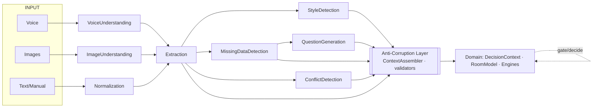

# AI Layer — contracts & boundary

- **Status:** Approved design (target model)
- **Date:** 2026-07-29
- **Scope:** The AI Layer's exact responsibilities + contracts, and the hard boundary to the Domain. No code.
- **Related:** `docs/domain_model.md`, `docs/decision_context.md`, `docs/vision_architecture.md`, `docs/prompt_engineering.md` (in the requirements pack), `docs/knowledge_base.md`

> **The one rule:** the AI Layer only *understands* — it turns messy human input into **structured, confidence-tagged signals**. It **never decides**. Scoring, ranking, selection, business rules, budget, spatial math, and all gating belong to the Domain. AI output is always a *proposal/detection*, validated and acted on by the Domain through an Anti-Corruption Layer.

---

## 1) The boundary (AI understands · Domain decides)

| Concern | AI Layer *(understand)* | Domain *(decide/own)* |
|---|---|---|
| **Extraction** | raw → proposed structured fields | validate/accept into `DecisionContext` |
| **Normalization** | units/synonyms/language canonicalization | consume canonical values |
| **Image Understanding** | images → visual signals | Room Intelligence assembles geometry; engine reasons |
| **Voice Understanding** | audio → transcript + entities | consume text |
| **Question Generation** | phrase candidate questions | decide **which** gaps are mandatory (ClarificationPlanner gate) |
| **Missing Data Detection** | flag absent/uncertain **from input** | decide which are **blocking** (decision-ready gate) |
| **Style Detection** | classify style/color/material tags | use tags in StyleMatch scoring |
| **Conflict Detection** | flag apparent **input** contradictions | compute **decision** conflicts (budget<floor, collision) + resolve |
| Scoring / Ranking / Selection | ✗ never | ✓ owns |
| Budget / spatial math / business rules | ✗ never | ✓ owns |
| Final decision / gating | ✗ never | ✓ owns |

> Reconciliation with earlier docs: AI does the **perception version** (over unstructured input, advisory); the Domain keeps its **deterministic checks + binding gate** (over structured data). Both exist; AI proposes, Domain disposes.

---

## 2) Common output envelope

Every contract returns signals in one envelope — never a bare value, never a decision:

```
AiSignal<T> {
  value: T,
  confidence: 0..1,
  provenance: { source: voice|image|text|manual, model_version, prompt_version },
  evidence?: [ spans | image_regions | transcript_offsets ]   // for explainability
}
```

---

## 3) The 8 AI contracts

```
Contract NormalizationService
  in:  RawInput(text | transcript)
  out: AiSignal<NormalizedText>            // units->cm/SAR, digits, synonyms, language
  guarantees: lossless-to-meaning; reversible mapping recorded
  MUST NOT: infer missing values, decide anything

Contract VoiceUnderstandingService
  in:  AudioRef
  out: AiSignal<Transcript> { text, language, entities? }
  MUST NOT: extract decisions; only transcribe + light entities

Contract ImageUnderstandingService
  in:  ImageRef[]
  out: AiSignal<VisualSignals> { roomTypeHint?, approxDimensions?, detectedItems[],
                                 colors[], materials[], lighting? }
  note: feeds Room Intelligence descriptive layer (behind ACL); never final geometry
  MUST NOT: assert measured dimensions as fact (always confidence-tagged)

Contract ExtractionService              // the LLM extractor
  in:  NormalizedInput (text + visual/voice signals)
  out: AiSignal<ExtractionResult> {
         proposedFields (json_schema-shaped: room/budget/style/items),
         perFieldConfidence, provenance }
  guarantees: structured output only; schema-valid; missing marked, never invented
  MUST NOT: score, rank, select, apply business rules, decide readiness

Contract StyleDetectionService
  in:  text | VisualSignals
  out: AiSignal<StyleTags> { style[], color_family[], material[] }   // controlled vocab
  MUST NOT: decide style weighting (Domain scoring owns that)

Contract MissingDataDetectionService
  in:  ExtractionResult + schema
  out: AiSignal<DetectedGaps> [ { field, kind: absent|uncertain|ambiguous } ]
  MUST NOT: decide which gaps block (Domain decision-ready gate owns that)

Contract QuestionGenerationService
  in:  DetectedGaps (that the Domain marked as needing input)
  out: AiSignal<Clarification[]> { question_ar, targets_gap }   // phrasing only
  MUST NOT: decide whether/when to ask, or ordering priority

Contract ConflictDetectionService
  in:  ExtractionResult (+ normalized input)
  out: AiSignal<ApparentConflicts> [ { kind, description, involved_fields } ]
  scope: INPUT-level contradictions only ("huge sofa in a tiny room")
  MUST NOT: compute decision conflicts (budget<essentials floor, collisions) — Domain does
```

---

## 4) Anti-Corruption Layer (AI never writes Domain state)



The **ContextAssembler** (domain-side) validates every `AiSignal`, rejects out-of-range/invalid values, maps to domain VOs, and records provenance/confidence. **No AI type crosses into the Domain unchecked.**

---

## 5) Provider abstraction · versioning · cost · errors
- **Provider-agnostic:** every contract has mock + real implementations; swap via **DI / feature flag** (mock-first). Contracts are stable; providers change.
- **Versioned:** each `AiSignal` carries `model_version` + `prompt_version`; Decisions can cite them.
- **Cost control:** skip AI when structured **manual** input suffices; cache; concise prompts; don't send images unless needed.
- **Error handling:** invalid output → retry → repair → **fallback to advisory**; failures logged (no sensitive data). AI failure never blocks the Domain — it degrades.
- **Determinism:** mock impls deterministic (testable); real impls constrained to **schema-validated structured output** (function calling / structured outputs).

---

## 6) Invariants
1. AI returns **signals only** (confidence + provenance) — never a score, rank, product, or business decision.
2. Every AI signal passes through the **ACL** before touching Domain state.
3. AI never **invents** values; absence is reported as a gap, not guessed (budget is never guessed).
4. All 8 contracts are **provider-swappable** and **versioned**.
5. Domain retains **deterministic** validation/gating and all decisions — AI failure ⟹ graceful advisory, never a wrong decision.

---

## 7) Mapping to current code
`lib/ai/` today has 3 of the 8 contracts: `LlmExtractionService` (Extraction), `VisionAnalysisService` (Image), `SpeechToTextService` (Voice) — all mock-first, plus `PromptBuilder` + `StructuredResponseParser` + `NormalizedInput`. **New contracts:** Normalization (today deterministic in `text_normalizer` — keep that, add the semantic AI layer on top), StyleDetection, MissingDataDetection, QuestionGeneration, ConflictDetection. Note: `BusinessRulesEngine` currently does the **deterministic** missing-data/conflict/question work over structured data — that **stays** (the Domain's gate); the AI contracts add the **perception** layer over unstructured input. Additive, no rewrite.
