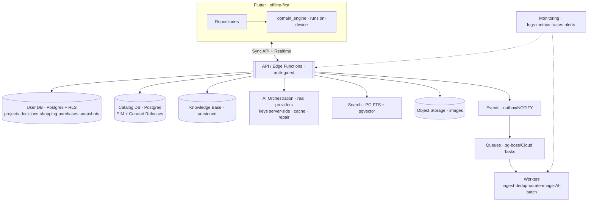

# Backend architecture

- **Status:** Approved design (target model)
- **Date:** 2026-07-29
- **Scope:** The Phase-2+ backend: database choice, events, queues, storage, caching, search, versioning, monitoring, sync, security. No implementation.
- **Related:** `docs/adr/0001-mvp-architecture-decisions.md`, `docs/catalog_strategy.md`, `docs/product_information_model.md`, `docs/ai_layer.md`, `docs/knowledge_base.md`, `docs/telemetry_analytics.md`, `docs/deployment.md`, `docs/flutter_app.md`

> The **Phase-2+ infrastructure layer.** The client already works fully offline (mock-first, local store), so the backend is **additive** — and because the client talks only through **repository interfaces**, the whole backend is a swappable data-source detail behind them, never a domain/UI change.
>
> **Note on ADR-0001:** the ADR chose Firebase for the MVP sync/auth/storage case. Looking at the full catalog/search needs below, this document **recommends Supabase (Postgres-centric)** and explains why. Because of the repository abstraction, this revision is reversible and does not change the domain or UI.

---

## 1) Firestore? Postgres? Supabase? — the decision

The **catalog is the query-heavy, relational, search-heavy core** (products↔variants↔offers↔stores↔brands↔taxonomy, dedup, filtering, semantic style search). User project data is document-shaped and needs offline/realtime sync. That split drives the choice:

| Need | Firestore | Postgres | **Supabase (PG+)** |
|---|---|---|---|
| Catalog joins / filter | ✗ weak | ✓✓ | ✓✓ |
| Semantic / vector search | bolt-on | ✓ pgvector | ✓ pgvector |
| Per-user data + row security | ✓ rules | ✓ RLS | ✓ RLS |
| Realtime / offline sync | ✓✓ SDK | needs layer | ✓ Realtime |
| Auth + Storage + Functions built-in | ✓✓ | assemble | ✓✓ |
| Relational integrity / versioning | ✗ | ✓✓ | ✓✓ |
| Open / self-host (no lock-in) | ✗ | ✓ | ✓ |

**Recommendation: Supabase** (managed **Postgres** + Auth + Storage + Realtime + Edge Functions + **pgvector**). It gives Postgres's relational + search power for the catalog/KB **and** auth/storage/realtime for user data in **one** system — no second DB, no bolt-on search. Firebase would force an awkward catalog model + an external search engine.

> Caveat: if the catalog stays tiny (mock/internal) and the team is deep in Firebase, Firebase + Algolia/Typesense is an acceptable MVP-backend. Either way it's **reversible** — it's a repository data-source, not a domain decision.

---

## 2) Architecture

---

## 3) Data stores
| Store | Engine | Holds | Notes |
|---|---|---|---|
| **User data** | Postgres + **RLS** | Project/Room/DecisionContext/Decision/ShoppingPlan/Purchase/Snapshot | realtime + offline sync; per-user isolation |
| **Catalog** | Postgres | PIM (product/variant/offer/store/brand/taxonomy) + **Curated Releases** | normalized; dedup graph; immutable releases |
| **Knowledge Base** | Postgres/config | versioned assertions/policies (releases) | low-write, high-read |

---

## 4) AI orchestration (real AI is server-side)
The AI Layer's 8 contracts get **real** implementations **server-side** (Edge Functions) — never in the client:
- **Protects API keys** (never shipped to devices), **controls cost** (concise prompts, prompt/response cache, skip when manual input suffices), enforces **structured outputs** + retry→repair→fallback.
- Client calls the AI contract → API → provider; **offline ⇒ mock/manual path** (no network needed for a decision).

---

## 5) Catalog ingestion & curation (async)

Runs on **workers** driven by **events + queues + schedules**; publishes an immutable **Curated Release** the decision layer pins.

---

## 6) Events
Domain/integration events via an **outbox table + Postgres NOTIFY** (→ managed Pub/Sub at scale):
`DecisionProduced · SnapshotTaken · ProductAdded/Updated · PriceChanged · AvailabilityChanged · CuratedReleasePublished · PolicyPublished · PurchaseRecorded`. Consumers: search reindex, cache invalidation, notifications, analytics.

---

## 7) Queues
Async jobs: ingestion · dedup · curation · **image processing** · long AI batch · catalog refresh · notifications. Engine: **pg-boss** (Postgres-backed, single-system) or Cloud Tasks/SQS. Idempotent workers; retries with backoff; dead-letter.

---

## 8) Storage
Object storage (Supabase Storage / S3) for **room + product images**: signed URLs, thumbnails, **EXIF/GPS strip** (privacy — engineering_standards), lifecycle rules. Never store raw images in the DB.

---

## 9) Caching
| Layer | Caches | Tech |
|---|---|---|
| CDN | product/room images, static | CDN |
| Server (Redis/Upstash) | hot catalog reads, **Curated/KB releases**, representative-offer, **AI response cache** | Redis |
| Client | offline store + last decision | local |

Invalidation is **event-driven** (PriceChanged → drop offer cache; ReleasePublished → warm new release).

---

## 10) Search
- **Postgres FTS** (`tsvector`, Arabic config) for keyword catalog search + facets (category/price/availability via indexed columns).
- **pgvector** for **semantic/style similarity** (embed style/color/material → nearest-neighbor for "like this but cheaper").
- Scale-out option: Typesense/Meilisearch for rich faceting; kept behind a `CatalogSearch` interface.

---

## 11) Versioning
Pin **everything** so decisions are reproducible: `CuratedCatalogRelease` · `KnowledgeBaseRelease` · `prompt/model version` · `schema version`. A stored **Decision** records all pins → replayable. DB migrations are forward-only + versioned; API + event schemas versioned.

---

## 12) Monitoring
Structured logs (**no PII/keys**), metrics (latency, **AI cost/calls**, decision counts, cache hit rate, queue depth), tracing, error tracking (Sentry), uptime + alerting. The `telemetry_analytics.md` events land here; dashboards per success-metric.

---

## 13) Sync (offline ⇄ backend)
Per-user, **single-writer-dominant** → last-write-wins on `updated_at` + tombstones; pull-since-cursor + push-local-mutations; **Realtime** for push. Rare conflicts (single device) → LWW; surface a merge only if two devices diverge.

---

## 14) Security
RLS per-user rows · API keys + secrets **server-only** · signed storage URLs · **image PII stripped** · rate limiting · auth (anonymous → email/social, JWT) · data-deletion (right-to-erasure).

---

## 15) Where decisions run
The **deterministic `domain_engine` runs on-device** (offline-first) over a **synced Curated-Release subset** — decisions work with no network. A **server-side decision endpoint** is an option for very large catalogs / cross-device consistency (same pure engine, run in an Edge Function). Purity makes it runnable in both places.

---

## 16) Invariants & mapping to code
1. Backend is **behind repository interfaces** — swappable (Firebase↔Supabase↔Postgres) without touching domain/UI.
2. Client stays **fully functional offline**; backend adds sync/real-AI/catalog/search, never a hard dependency.
3. Real **AI + secrets are server-only**; the client never holds keys.
4. Decisions **pin versions** (catalog + KB + prompt) for reproducibility.

Today's `InMemoryProjectRepository` / mock AI / JSON catalog become **backend-backed data sources** (`Local` → `Remote`) behind the same interfaces — additive, no rewrite.
