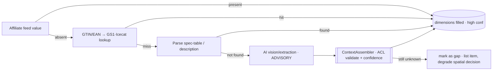
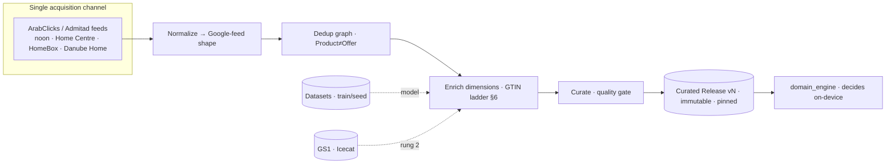

# Catalog data sources — strategy & the one chosen path

- **Status:** Recommended strategy (one path chosen) — pending approval
- **Date:** 2026-07-30
- **Scope:** Where catalog data actually *comes from* — retail APIs, affiliate APIs, furniture datasets, commerce feeds, manufacturer feeds — across **Saudi Arabia · GCC · Global**. Compares every class, then commits to **one** acquisition strategy. No implementation.
- **Related:** `docs/catalog_strategy.md` (deliberately deferred sources — "ignore data sources"), `docs/product_information_model.md` (the 17 facets we must fill), `docs/backend_architecture.md` (§5 ingestion — the `sources` node, now scoped), `docs/ai_layer.md` (AI enrichment is advisory only), `docs/measurement_engine.md` (why dimensions are non-negotiable).

> `catalog_strategy.md` designed the **shape** of the catalog (Master vs Curated, Product≠Offer, normalization, dedup, versioned releases) and said *"ignore data sources."* This doc fills that gap: it picks the **single acquisition channel** that feeds the Master Catalog, and states exactly what every rejected alternative is demoted to.

---

## 1) The real question (this is a decision system, not a store)

A furniture blog needs **links that convert**. Our decision engine needs a **decision substrate**: for every candidate it must know **price (SAR) · availability · category/role · style/color/material · image · and — critically — physical dimensions** (the Measurement Engine cannot place a sofa it can't measure). That raises the bar and reframes the whole comparison:

| The engine needs… | Why | Cheapest reliable origin |
|---|---|---|
| Price + availability, **localized (SAR, in-country)** | recommend only what's buyable here | regional **offer** feeds |
| Category / role | map to a requirement (bed, sofa…) | any feed |
| Style / color / material tags | StyleMatch scoring | feed + **AI/vision + datasets** |
| **Dimensions (W×D×H)** | spatial fit / collision / clearance | **manufacturer/GS1** or the **Google-feed dimension attributes**; rarely in raw affiliate feeds |
| Image | UI + vision enrichment | any feed |

**The central tension:** no single source gives *both* regional purchasable offers *and* deep attributes. Coverage lives in one place; dimensions live in another. The strategy has to resolve that — not pretend a source does both.

---

## 2) The five source classes — what each *actually* provides

| Class | What it really is | Gives offers? (price+avail+SAR) | Gives dimensions? | Legal/clean | Monetizes? |
|---|---|---|---|---|---|
| **Retail APIs (official)** | a retailer's own product API | ✓ (if it exists) | sometimes | ✓ | ✗ |
| **Affiliate APIs / networks** | networks syndicating retailer **data feeds** (CSV/XML/JSON) + tracked links | ✓✓ **regionally** | ✗ usually shallow | ✓ | ✓✓ commission |
| **Furniture datasets** | research/ML corpora (images, 3D, metadata) | ✗ (no price/stock/locale) | ✓ shape, not commerce | ✓ open licenses | ✗ |
| **Commerce feeds** | the **Google/Meta feed *standard*** (RSS 2.0 + `g:` namespace) | it's a *format*, not a source | **has** `product_length/width/height` fields | ✓ | ✗ |
| **Manufacturer feeds** | GS1 **GDSN** / Icecat / BMEcat‑ETIM / PIM syndication | ✗ (no retail price/stock) | ✓✓ **deepest** (dims, EAN, materials) | ✓ (subscription) | ✗ |

Key reading: **affiliate networks own regional coverage; manufacturer/GS1 own attribute depth; the Google feed is the one *standard* that carries furniture dimensions; datasets are ML fuel, not a live catalog.**

---

## 3) Landscape by geography

### Saudi Arabia (the launch market)
- **Official retail APIs:** effectively **none public** — Home Centre (Landmark), SACO, Danube Home, Homzmart, IKEA KSA don't expose product APIs. IKEA has **no official product API** (only ToS‑risky third‑party scrapers — *rejected*).
- **Marketplace affiliate (rich + monetized):** **noon** (20M+ SKUs; `affiliates.noon.com`, also via ArabClicks/Admitad) and **Amazon.sa Associates** (home & kitchen ≈ up to 5%). ⚠️ Amazon **PA‑API is being retired (Apr 30 2026 → Creators API)** and the `.sa` locale was always thinly supported — treat Amazon.sa as *links*, not a product-data pipe.
- **Regional networks carrying furniture brands:** **ArabClicks** and **Admitad** syndicate **Home Centre, HomeBox (Landmark), Danube Home, noon** — as **affiliate data feeds** (CSV/XML/JSON).

### GCC (UAE · Kuwait · Bahrain · Oman · Qatar)
- **ArabClicks** is purpose-built for the GCC (UAE, KSA, Kuwait, Bahrain, Oman). **Admitad** and **ArabyAds/Boostiny** cover the same brand set. HomeBox operates KSA/UAE/Bahrain/Qatar. Same shape as KSA: **coverage flows through the regional networks, not official APIs.**

### Global
- **Awin · CJ · Rakuten · Impact** — mature networks with excellent **product feeds + deep linking**, but their furniture advertiser base is **US/UK/EU**; thin and non‑localized for Gulf buyers (wrong price, currency, availability, shipping).
- **Datasets (open, global):** **ABO** (Amazon Berkeley Objects — 147,702 listings, 398,212 images, ~8k with glTF **3D models**, open license), **3D‑FUTURE** (9,992 furniture shapes + 20,240 scene images), Google Scanned Objects, Objaverse.
- **Attribute backbone (global):** **GS1 GDSN / Icecat** — standardized dimensions, weight, EAN/UPC; strong in electronics/DIY/FMCG, **thinner for furniture** and gated by subscription + manufacturer participation.

---

## 4) Comparison matrix (scored for *our* need)

Weighted for a KSA-first decision system. **5 = excellent, 1 = poor.**

| Class | Regional coverage | Purchasable (price+stock) | Attribute depth (dims!) | Legality | Integration cost | Monetization | **Fit as PRIMARY** |
|---|---|---|---|---|---|---|---|
| Official retail APIs | 1 (barely exist) | 5 | 3 | 5 | 4 (per‑retailer) | 1 | **✗ low** |
| **Regional affiliate feeds** | **5** | **5** | **2** | **5** | **4** | **5** | **✓ HIGHEST** |
| Global affiliate feeds | 2 | 3 | 3 | 5 | 4 | 5 | ✗ wrong geo |
| Furniture datasets | 1 | 1 | 3 (shape only) | 5 | 5 | 1 | ✗ not a live catalog |
| Commerce feed *standard* | — (format) | — | 4 (defines dim fields) | 5 | 5 | — | ★ **adopt as internal format** |
| Manufacturer / GS1‑Icecat | 2 | 1 (no retail price) | **5** | 4 | 2 (subscription) | 1 | ✗ enrichment only |

Two things fall out immediately: **regional affiliate feeds are the only class that scores high on coverage + purchasability + monetization**, and its one weakness (dimension depth = 2) is exactly the strength of **manufacturer/GS1 (5)** and the **Google feed standard (4)**. That complementarity *is* the strategy.

---

## 5) The decision — ONE strategy

> **Aggregate regional affiliate *data feeds* (ArabClicks / Admitad as the primary networks, carrying noon · Home Centre · HomeBox · Danube Home) as the single source of truth for offers, normalized on ingest into an internal catalog that adopts the Google‑Merchant feed shape, then enrich dimensions via a GTIN‑keyed ladder — all behind the existing `Catalog` repository interface as swappable data sources.**

One primary acquisition channel. One internal format. One enrichment ladder. Everything else is explicitly subordinate or rejected.

**Why this and not the others:**
- **vs official retail APIs** — they *don't exist* regionally (no IKEA API); N per‑retailer integrations for near‑zero coverage, and no monetization. Rejected as primary; welcomed opportunistically *if* a retailer ever ships one (it drops in behind the same interface).
- **vs global networks** — right tech, wrong geography: US/UK/EU prices, currency, stock. Rejected for launch; a future non‑Gulf market would re‑enable them behind the same interface.
- **vs datasets as catalog** — no price, no stock, not Saudi, not purchasable. Demoted to **model‑training + demo seed** (below).
- **vs manufacturer/GS1 as primary** — deepest attributes but **no retail offer** (price/availability), thin furniture/KSA coverage, subscription‑gated. Demoted to **secondary dimension enrichment** (below).
- **vs scraping** (Apify/RapidAPI IKEA etc.) — **rejected outright**: ToS/legal risk, brittle, unmonetized. Not part of the strategy.

**Why it's coherent, not "do everything":** there is exactly **one** channel we *acquire offers from* (regional affiliate feeds). Enrichment and datasets don't add offers — they add *attributes* to offers we already have. That's one pipeline with one input, not five strategies.

---

## 6) Solving the dimension gap *inside* the one strategy

Affiliate feeds are shallow on W×D×H, and the engine can't place what it can't measure. We adopt the **Google‑Merchant feed shape as the internal format precisely because it defines** `product_length / product_width / product_height / product_weight` — a standard slot for dimensions — then fill it with a confidence‑tagged ladder:

- The ladder stops at the first confident hit; each value records **provenance + confidence** (per `product_information_model.md`).
- **AI never invents a dimension** — vision/extraction are advisory, ACL‑gated, and a miss becomes a **gap**, not a guess (per `ai_layer.md`). A gap means the product still *lists*, but any **spatial** decision that needs it is flagged/degraded — never silently wrong (per `measurement_engine.md`).

---

## 7) Where the rejected classes are actually used (subordinate roles)

Nothing is wasted; each rejected class has one narrow job that does **not** make it a second acquisition strategy:

| Class | Demoted role | Adds offers? |
|---|---|---|
| **Furniture datasets** (ABO, 3D‑FUTURE) | train the **style/vision classifier**; seed the **mock/demo catalog** (already how the MVP ships) | ✗ |
| **Manufacturer / GS1‑Icecat** | **secondary dimension/material enrichment** by GTIN (ladder rung 2) | ✗ |
| **Global affiliate networks** | dormant; re‑enabled behind the interface for a future non‑Gulf market | ✗ (later) |
| **Official retail APIs** | opportunistic drop‑in *if/when* a retailer ships one | ✓ (bonus, same interface) |
| **Google/Meta feed standard** | the **internal normalized format** every source maps into | — |

---

## 8) The pipeline (one input → Curated Release)

This is exactly the `Normalize → Dedup → Master → Curate → Release` flow already drawn in `backend_architecture.md §5` — this doc just names the `sources` node it left as "out of scope."

---

## 9) Phasing (honest about *now*)

- **MVP (today):** catalog is a **bundled JSON asset** (mock), seeded partly from open **datasets**. **No live source is wired** — and the client works fully offline. *This strategy changes nothing in the MVP.*
- **Phase 2:** stand up **one** ingestion worker for **one** affiliate feed (recommend **noon via ArabClicks** first — largest SKU count, single integration), normalize → enrich → publish a Curated Release. Swap `AssetCatalogRepository` → `RemoteCatalogRepository` behind the unchanged interface.
- **Phase 3+:** add more feeds through the *same* worker/format; turn on GTIN→GS1/Icecat enrichment; (optionally) any official retail API that appears.

---

## 10) Legal & compliance
- **Affiliate feeds are licensed data** — used within network ToS (tracked links, no term‑bidding, no reselling). ✓
- **Scraping is out** — no Apify/RapidAPI retailer scrapers; ToS/legal risk. ✗
- **Datasets** — respect each license (ABO/3D‑FUTURE are open for research/commercial per their terms; verify before shipping model weights). 
- **Images** — store via signed URLs, **strip EXIF/GPS**, honor retailer image rights (per `backend_architecture.md §8`, `engineering_standards`).
- **Price/availability are volatile** — always event‑refreshed and **pinned per Curated Release** so a stored Decision stays reproducible.

---

## 11) Invariants
1. **One acquisition channel** (regional affiliate feeds); every other class is enrichment, training, or a rejected/deferred option — never a parallel offer source.
2. **One internal format** — the Google‑Merchant feed shape (which carries the dimension fields); every source maps into it on ingest.
3. **Dimensions are filled by a confidence‑tagged ladder; AI never invents them; a miss is a gap, not a guess.**
4. **Everything sits behind the `Catalog` repository interface** — sources are swappable data‑source details, never a domain/UI change.
5. **Offers are pinned per Curated Release** — decisions stay reproducible even as live prices move.
6. **Legal by construction** — licensed feeds only; no scraping.

---

## 12) Mapping to current code
Today: `assets/catalog/catalog.json` + an `AssetCatalogRepository` behind `CatalogRepository`. **Evolution (additive):** add a `RemoteCatalogRepository` (affiliate‑feed backed) + an ingestion worker (normalize→dedup→enrich→curate→release) exactly where `backend_architecture.md` placed it; keep the mock as the offline fallback and the demo/seed. Datasets feed the future style/vision model, not the runtime catalog. **No rewrite — one new data source behind an interface that already exists.**
