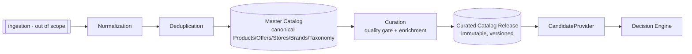
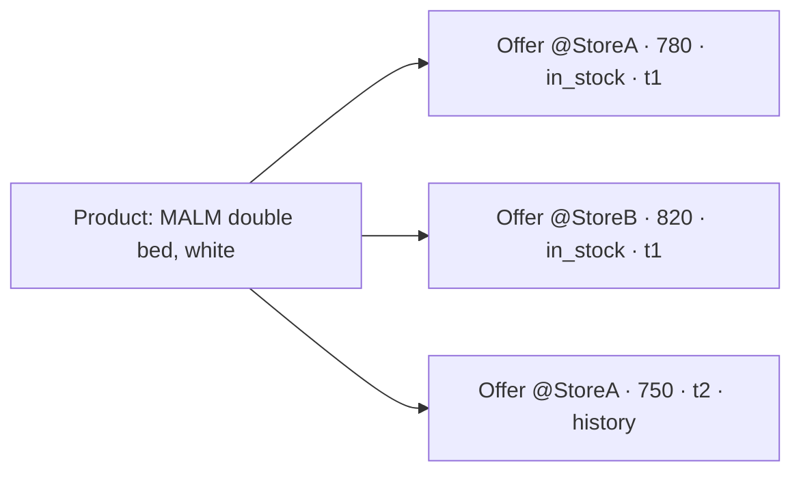
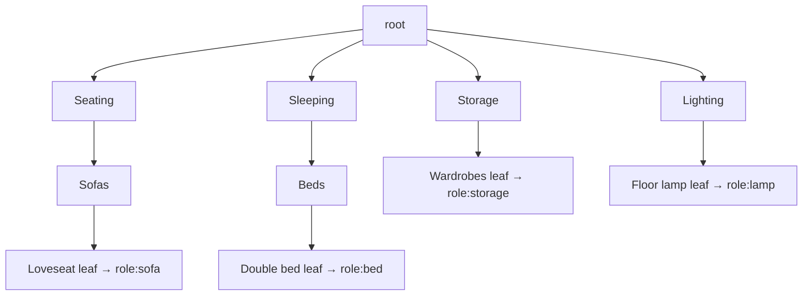
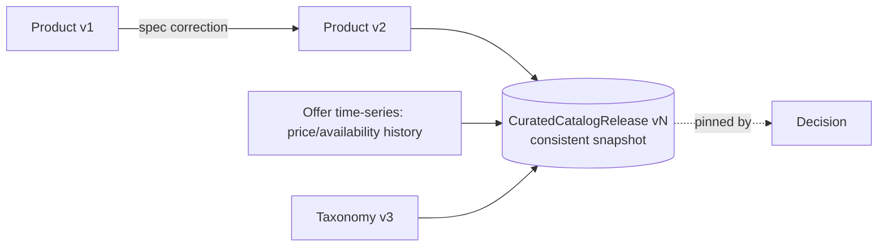
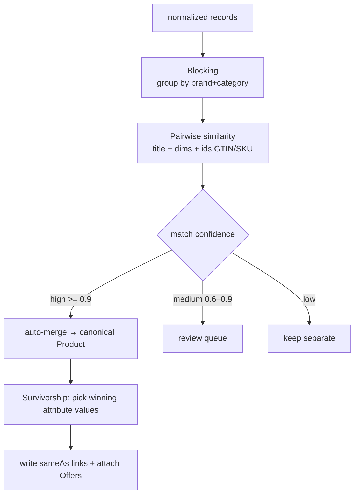

# Catalog Strategy — model & architecture

- **Status:** Approved design (target model)
- **Date:** 2026-07-29
- **Scope:** The catalog *structure*. **Data sources are out of scope** (ingestion mechanics live in `docs/product_catalog_erd.md` §evolution). No code.
- **Related:** `docs/product_catalog_erd.md`, `docs/decision_engine.md`, `docs/knowledge_base.md`, `docs/domain_model.md`

---

## 0) Two core separations

1. **Master vs Curated.** The **Master Catalog** is the complete, normalized, deduplicated superset of everything known. The **Curated Catalog** is a vetted, versioned, decision-ready *release* — the only thing the engine reads.
2. **Product ≠ Offer.** A **Product** is the store-agnostic, price-agnostic *item concept* (its intrinsic spec). An **Offer** is a specific *sale* of that product by a store at a price/time. One Product → many Offers.



---

## 1) Master Catalog

The **warehouse**: every product ever ingested, normalized to canonical schema, deduplicated into canonical `Product`s, with all `Offer`s, `Store`s, `Brand`s, and the full `CategoryTaxonomy`. Mutable (grows with ingestion), may contain unvetted/noisy records. **Never used directly by decisions.**

- Purpose: single normalized source of truth for curation.
- Contents: canonical Products + full Offer history + Stores + Brands + Taxonomy + dedup graph.
- Access: write from ingestion (out of scope); read by the curation pipeline.

## 2) Curated Catalog

A **published, versioned projection** of the Master that passed quality gates and enrichment. This is what `CandidateProvider` reads; decisions **pin a release** for reproducibility (mirrors the Knowledge Base release model).

- Curation pipeline: **quality gate** (valid dimensions, clear price via ≥1 live offer, consistent classification, usable image, availability known) → **enrichment** (style/color/material/room-suitability tags, quality signal) → **dedup verification** → **publish** as `CuratedCatalogRelease`.
- Immutable per release; a Decision references `CuratedCatalogRelease@vN`.

| | Master Catalog | Curated Catalog |
|---|---|---|
| Completeness | superset (all) | vetted subset |
| Mutability | mutable | immutable releases |
| Quality | mixed | gate-passed |
| Used by decisions | ✗ | ✓ (pinned release) |

---

## 3) Entity model (Product · Offer · Store · Brand)

```mermaid
classDiagram
  class Product {
    +ProductId id
    +ProductVersion version
    +LocalizedText title
    +CategoryRef category
    +BrandRef brand
    +ProductDimensions dims
    +Tag[] style/color/material
    +Tag[] roomSuitability
    +Identifier[] ids  // GTIN/SKU/MPN
    +Image[] images
    +Map specAttributes
  }
  class Offer {
    +OfferId id
    +ProductRef product
    +StoreRef store
    +Money price
    +AvailabilityStatus availability
    +Url url
    +Timestamp capturedAt
    +Validity validity
    +Condition condition  // new/used
  }
  class Store { +StoreId id +name +Region region +StoreType type +QualitySignal quality +ReturnPolicy policy }
  class Brand { +BrandId id +name +BrandTier tier +QualitySignal quality }
  class ProductGroup { +GroupId id +variantAxis }  // color/size variants

  Product "1" --> "N" Offer : has (by id)
  Offer "N" --> "1" Store : from (by id)
  Product "N" --> "1" Brand : by (by id)
  ProductGroup "1" *-- "N" Product : variants
```

- **Product** *(Aggregate Root)* — intrinsic, **no price/availability**. Store-agnostic. *Invariants:* valid dimensions; classified to a taxonomy leaf; belongs to one brand.
- **Offer** *(Aggregate Root)* — commercial instance `Product×Store×time`. Time-versioned → **price/availability history**. The engine's "price" comes from selecting a **representative Offer** (best price / preferred store / freshest).
- **Store** *(Aggregate Root)* — retailer; carries a quality signal + return policy.
- **Brand** *(Aggregate Root)* — manufacturer; tier (budget/mid/premium) + quality signal.
- **ProductGroup** *(Aggregate Root)* — groups variants (same model, different color/size).



---

## 4) Category Taxonomy

A **versioned tree**: root → category → subcategory → leaf. Each node maps to a KB **FurnitureRole** and carries synonyms (for normalization).



- Node `{ categoryId, parent, name(localized), roleMapping→FurnitureRole, synonyms[], version }`.
- Products classify to a **leaf**; the taxonomy is **the canonical vocabulary** — normalization maps source categories → canonical leaves.

---

## 5) Product Relationships

Typed edges between Products (product-level, richer than KB's role-level relations):

| Relationship | Meaning |
|---|---|
| `variantOf` | same model, different color/size (→ ProductGroup) |
| `partOfSet` | member of a collection/set (dining set) |
| `accessoryOf` / `requires` | e.g., bed frame requires mattress size X |
| `successorOf` | newer model replaces an older one |
| `complements` | product-level "goes-with" (this bed ↔ that nightstand) |
| `sameAs` | dedup linkage to a canonical product (see §9) |

---

## 6) Product Alternatives

The catalog provides **substitution pools**, not ranked lists (ranking is context-dependent and belongs to the Decision Engine's Alternative Engine).

- **SubstitutionGroup** = products serving the **same role** within a **spec band** + **price band** (e.g., "double beds, 140–160 cm, 500–900 SAR").
- The catalog exposes the *pool*; the **Alternative Engine** ranks it against a specific `DecisionContext`.
- Clear boundary: **catalog = equivalence classes; engine = ranked alternatives.**

---

## 7) Product Compatibility

**Intrinsic, product-to-product** compatibility (distinct from the engine's *context* compatibility, which is product-to-room/budget):

| Compatibility kind | Example |
|---|---|
| Dimensional | mattress size ↔ bed frame size |
| Collection | same collection → high cohesion |
| Style/color/material | product-level affinity refining KB role-level rules |
| Functional | modular pieces that connect |

Used to strengthen bundle cohesion and to validate `requires`/`accessoryOf` relationships. **Two senses of "compatibility" are kept separate:** catalog-intrinsic here vs context-fit in `decision_engine.md`.

---

## 8) Product Versioning



- **Product version** — intrinsic attribute change (spec fix, image) → new `ProductVersion`; canonical id stable.
- **Offer versioning** — time-series of price/availability states (history retained).
- **Taxonomy version** — tree changes → `TaxonomyVersion`.
- **CuratedCatalogRelease** — bundles a **consistent snapshot** (product versions + offer snapshot + taxonomy version + quality report). A **Decision pins a release** → reproducibility.

---

## 9) Normalization Strategy

Turn heterogeneous ingested records (sources ignored) into the **canonical, comparable** schema, ready for dedup:

| Aspect | Rule |
|---|---|
| Units | cm/inch → **cm**; convert currencies → **SAR** |
| Attributes | source fields → canonical `Product` attributes (mapping) |
| Category | source category → canonical **taxonomy leaf** (synonyms/mapping) |
| Tags | style/color/material → **controlled vocabulary** (canonical tags) |
| Text | Arabic/English title cleanup, whitespace, casing, diacritics |
| Values | validate/clamp to sane ranges; reject implausible |

Output: normalized records that are **directly comparable** across sources.

---

## 10) Deduplication Strategy

Collapse duplicate records (same physical product from many sources) into one **canonical Product**; the source records become **Offers** linked to it.



- **Signals:** brand + normalized-title similarity + dimensions match + shared identifiers (GTIN/SKU/MPN).
- **Blocking** limits comparisons (by brand+category) for scalability.
- **Survivorship policy:** on merge, each attribute's winner = most-complete / highest-source-authority / most-recent (configurable, versioned).
- **Confidence bands:** high → auto-merge; medium → human review; low → stay separate.
- **Idempotent & auditable:** re-runnable; every merge keeps `sameAs` provenance and can be reversed.

---

## 11) How the engine consumes the catalog

`CandidateProvider` reads a **Curated Release**: for each needed `FurnitureRole`, it selects Products (via taxonomy roleMapping), resolves a **representative Offer** (price/availability), and emits `Candidate { productRef, dims, price(from offer), tags, availability, rating }` to the Decision Engine. The engine never sees Master data, raw offers, or sources.

---

## 12) Invariants

1. **Product carries no price**; all commercial data lives in **Offers**.
2. Decisions read **only** a pinned **Curated Release**, never the Master.
3. Every canonical Product classifies to exactly one **taxonomy leaf** and one **Brand**.
4. Dedup is **idempotent**, confidence-scored, and keeps `sameAs` provenance.
5. Curated releases are **immutable**; changes → a new release.

---

## 13) Mapping to current code (evolution)

Today `lib/shared/models/catalog_product.dart` **conflates Product + Offer** (dimensions/category/brand/tags **and** price/currency/availability/supplier/urls) and the static `assets/catalog/catalog.json` is effectively a tiny **Curated Release**.

Evolution (additive, no rewrite): split `CatalogProduct` into **Product** (intrinsic) + **Offer** (commercial) + `Store`/`Brand` refs; formalise the **taxonomy**; treat the JSON asset as `CuratedCatalogRelease v0`. `product_catalog_erd.md` holds the flat ERD; this document adds the Master/Curated split, normalization, dedup, and versioning around it.
