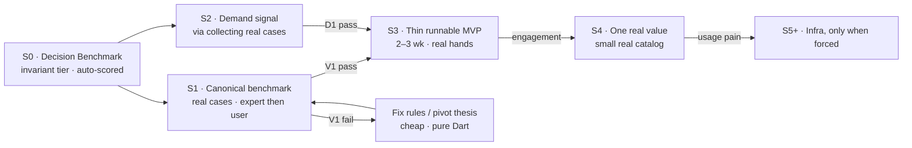

# CTO roadmap — evidence-first, effort-minimal

- **Status:** Approved (CTO) — supersedes `implementation_roadmap.md`. Execution started at S0.
- **Date:** 2026-07-30
- **Mandate:** Maximize the probability of launching a successful MVP with the **smallest possible engineering effort**. Challenge every assumption; reject anything unnecessary; explain every rejection.
- **Supersedes:** `implementation_roadmap.md` (build-sequenced). This plan is **evidence-sequenced**.

> **The one fact that rewrites the plan:** `domain_engine`, `shared/models`, `ai`, `core/errors` are **pure Dart — zero Flutter imports** (only `equatable` + `uuid`). The decision engine *is* the product, and it can be run and judged **without Flutter, a device, a backend, or CI**. Therefore the "no Flutter in the environment" blocker does **not** block the highest-value work. Both prior opinions assumed it did.

---

## 1) Verdict on the two opinions

### Opinion A — "stop at M0 (analyze / test / run), CI later"
| Claim | Verdict | Why |
|---|---|---|
| Stabilize before building more | **Right instinct, wrong milestone** | Stabilizing is correct; but "M0 = green build" proves the code *compiles*, not that its output is *worth anything*. |
| `flutter analyze` | **Task, not a milestone** | Necessary hygiene. Elevating it to a headline goal is engineering navel-gazing. |
| `flutter test` | **Correct but dangerously insufficient** | Existing tests prove the engine does what it was *coded* to do — not that the recommendations are *good*. Green tests + bad recs = a well-tested useless product. |
| `flutter run` | **Correct** | You must see it run — but only enough to demo, not perfected. |
| **CI later** | **Correct** | For a 1–2-person pre-PMF team, CI is low-value ceremony; local `analyze`/`test` suffices. *(I reverse my own earlier "CI first" advice — it was wrong for this stage.)* |
| *Missing* | **The whole point** | A never asks whether the output has value. It optimizes the machine, not the outcome. |

### Opinion B — "after M0: human validation, DoD, product validation"
| Claim | Verdict | Why |
|---|---|---|
| Human validation (rec quality) | **Correct — and it's THE thing** | But sequencing is **wrong**: B gates it behind M0. The engine is pure Dart; validation needs **no working app**. |
| Definition of Done | **Partially correct** | A *one-line* DoD now, yes. A *formal DoD document* now is premature process — reject it. |
| Product validation | **Correct, but mis-ranked** | B lists it last; it's **#1**. And it too is falsely gated behind M0. |
| *Missing* | **Demand + the false dependency** | B never challenges "validate after the app works," and never questions whether the giant architecture should be built at all. |

**Both are incomplete for the same reason:** they argue *engineering readiness* (build / test / CI / DoD) while the company has **zero evidence** the product is wanted or that the engine's decisions are trusted. Inside-out, when the moment demands outside-in.

---

## 2) The reframe

- **The engine is the product.** It's pure Dart. Validate its decisions **now**, headless, on mock data.
- **The biggest risk is not technical.** The architecture is *over*-built, not under-built. The risk is **product**: 21 docs and ~3,900 LOC, and not one validated user interaction.
- **Effort follows evidence.** Every infrastructure spend (backend, real AI, ingestion, spatial, CI) stays **locked** until a specific piece of evidence unlocks it.

---

## 3) The roadmap I would execute

Gates are **evidence**, not green builds.

| Stage | Time | Goal | Gate (evidence) |
|---|---|---|---|
| **S0 · Decision Benchmark — invariant tier** | ½ wk | build the **auto-scored** invariant benchmark over the *existing* engine (fit · availability · budget sanity · coverage · Arabic synonyms) — `benchmark/` | `dart run benchmark/run_benchmark.dart` green — no hard rule violated |
| **S1 · Canonical benchmark** ⭐ | 2 wk | **the real next milestone** — collect ~12 **real** cases (Reddit/Quora/interviews), expert writes acceptance criteria + 1–5 rubric (no single golden answer), score; then reuse the *same* set for user trust | **V1:** `benchmark_score` clears the bar, then a clear majority of users rate 4–5 |
| **S2 · Demand** (same motion as S1 collection) | — | collecting real cases *is* the demand check: do people actually post/ask this? | **D1:** real cases exist in the wild → the problem is real |
| **S3 · Thin MVP** | 2–3 wk | app *runs* the happy path on a device, offline, mock data, saves locally (simple). **This is where a redefined "M0" lives — not first.** Put in 10–20 real hands. | usable end-to-end without crashing; users complete a decision |
| **S4 · One real value** | when S3 engages | the *single* thing that most increases trust — a **small real catalog slice** (one affiliate feed, or even a hand-curated ~100 SKUs) so recs are **buyable** | users act on a real recommendation |
| **S5+ · Infra** | when usage *forces* it | backend/sync, real AI, spatial, CI — each unlocked by a **named pain**, never a calendar | the pain is real and measured |

The Trust-Test scenarios become the **golden regression set** — the engine's permanent decision-quality suite, and the only "Definition of Done" that matters early: *a target user trusts the recommendation, and it runs offline without crashing.*

---

## 4) Rejections, postponements, redesigns (explicit)

**DELETE now:**
- **CI-first** — ceremony at this team size. Add when a 2nd engineer joins or paying users make regressions costly.
- **Formal DoD document** — premature process. Replace with the one-line DoD above.
- **More design docs** — there are 21. Marginal doc value ≈ 0. Stop designing; start validating.

**POSTPONE (locked until evidence):**
- Backend / Supabase / RLS / sync · real AI integration · affiliate ingestion pipeline · spatial / Measurement Engine · semantic search · multi-room journey · shopping plan / purchases · ARB migration · shell navigation · most target screens.

**REDESIGN:**
- The **definition of M0** — from "green build" to "runnable enough to validate," and moved from *first* to *stage 3*. Validation comes before polish.

**KEEP:**
- The pure-Dart engine + models (the asset). The clean AI/domain boundary. The mock-first, offline-first stance. The design docs as a *reference* for when infra is actually unlocked.

---

## 5) Why this beats the build-sequenced roadmap
The old plan spends months building infrastructure (M0→backend→AI→spatial→journey) for a value proposition **no human has confirmed**. If the engine's recs aren't trusted, every one of those months is wasted. This plan buys the **cheapest possible evidence first** (2–3 weeks, no new infra), then lets evidence — not a Gantt chart — authorize each spend. Same destination if the thesis is true; a fast, cheap "no" if it isn't.

---

## 6) Invariants
1. **Evidence unlocks effort** — no infrastructure without a named, measured pain.
2. **Validate the engine before the app** — it's pure Dart; the app is not a prerequisite.
3. **Product risk > technical risk** — spend accordingly.
4. **The scenarios are the DoD** — golden decision-quality set over process documents.
5. **Smallest thing that produces evidence** — always.
