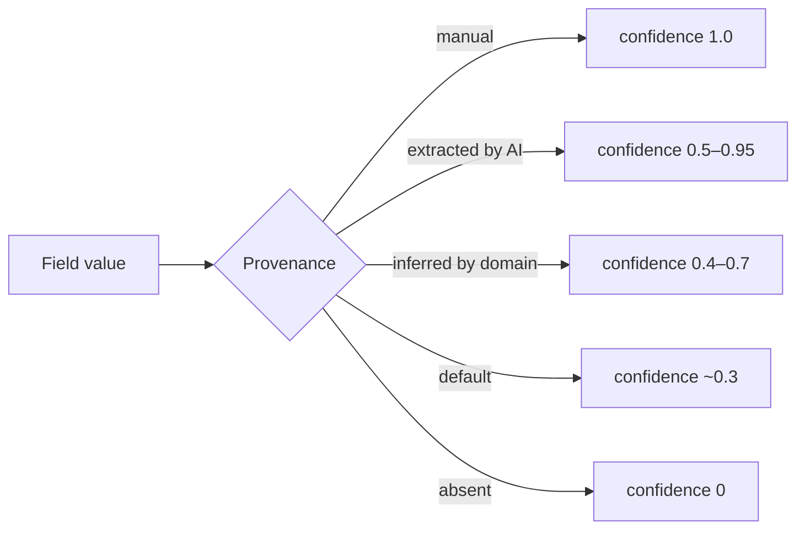
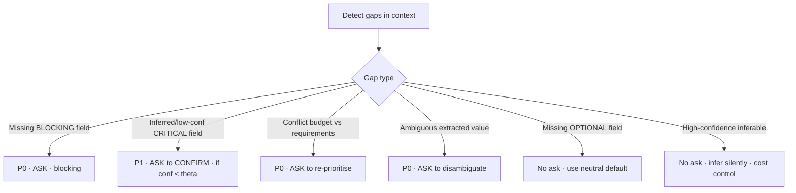
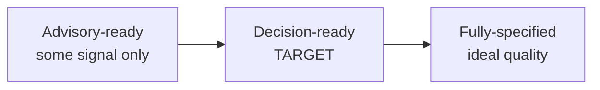
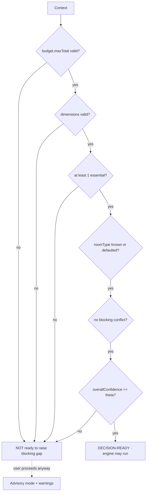
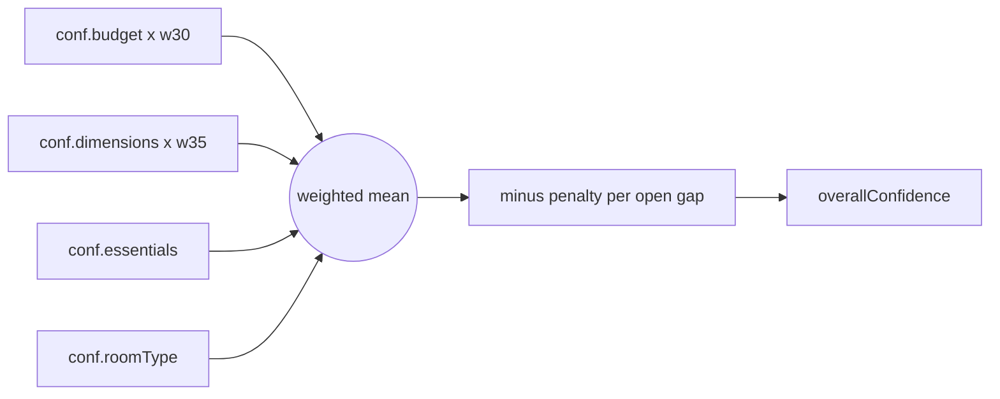
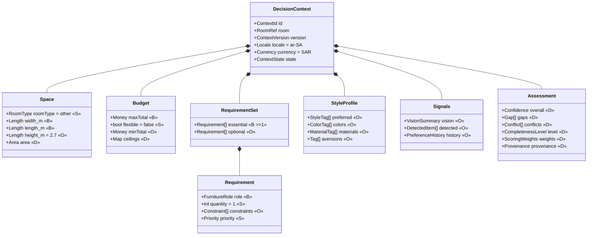
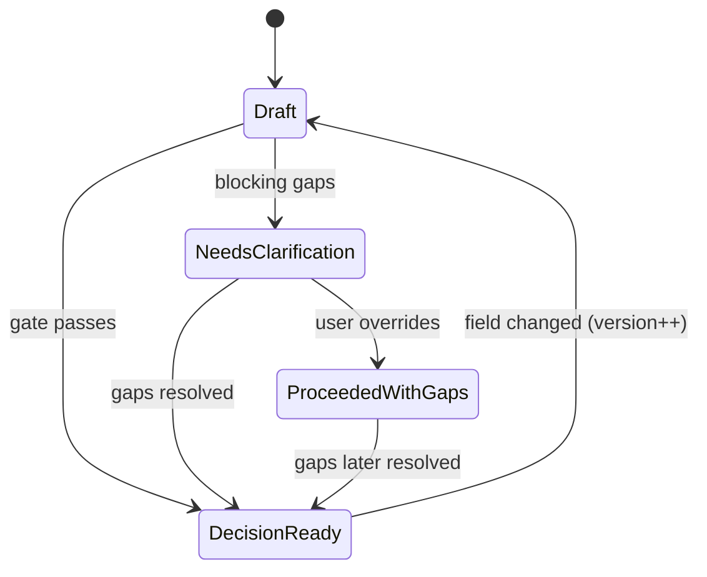

# Decision Context — the decision brief

- **Status:** Approved design (target model)
- **Date:** 2026-07-29
- **Scope:** The versioned entity inside each `Room` that the Domain Engine consumes. No code.
- **Related:** `docs/domain_model.md`, `docs/furnishing_project_model.md`, `docs/knowledge_base.md`

> Hard invariant: **the AI only proposes field values; the domain decides what is missing, what to ask, and when it's enough.**

---

## 0) Guiding principle

The Decision Context is the **only** input the engine reads. "Complete" ≠ "every field filled." Complete means **decision-ready**: enough *valid, trustworthy* information to produce a **defensible** decision. Every value carries **provenance** (how it was obtained) and **confidence** — an *inferred* dimension is not the same fact as a *user-stated* one.

---

## 1) What information is required *before any recommendation*?

The engine does four things — **filter, score, allocate, bundle**:

| Engine step | Needs |
|---|---|
| Filter (fit / eligibility) | **Room dimensions**, room type, requirement roles, constraints |
| Score — RoomCompatibility 35% | **Room dimensions**, room type |
| Score — BudgetFit 30% | **Budget max**, category ceilings |
| Score — StyleMatch 20% | Style preferences *(optional; neutral if absent)* |
| Allocate | **Budget max**, room type |
| Bundle (tiers) | **Budget max**, **≥1 essential requirement** |

**The irreducible core:** **Budget max · Room dimensions · ≥1 Essential requirement · Room type.** Without these, only *advisory* output is possible.

---

## 2–4) Mandatory / Optional / Inferable

- **B — Blocking-mandatory:** must be present and valid, and **cannot be safely inferred** → if absent, the system *must ask*.
- **S — Soft-mandatory:** needed, but has a **safe default or reliable inference** → never blocks.
- **O — Optional:** pure enrichment → absent = neutral default, **never ask**.
- **D — Derived:** computed by domain/policy.

| Field | VO/Type | Class | Inferable from | Default | Validation |
|---|---|---|---|---|---|
| **budget.maxTotal** | Money | **B** | **Never** (guessing budget is forbidden) | — | > 0 |
| **space.dimensions.width/length** | Length (m) | **B** | *weakly* from vision/room-type → **confirm only** | — | 1–30 m |
| **requirements.essential ≥ 1** | Requirement[] | **B** | from room type → **confirm** | — | ≥ 1 role |
| space.roomType | enum | **S** | from description keywords | `other` | in taxonomy |
| budget.flexible | bool | **S** | — | `false` | — |
| requirement.quantity | int | **S** | — | `1` | ≥ 1 |
| requirement.priority | enum | **S** | from which list | list-derived | — |
| locale / currency | VO | **S** | — | `ar-SA` / `SAR` | valid code |
| space.dimensions.height | Length (m) | **O** | — | `2.7` | 2–6 m |
| style.preferred / colors / materials | Tag[] | **O** | from vision | empty (neutral) | in taxonomy |
| style.aversions | Tag[] | **O** | from history | empty | — |
| requirement.constraints | Constraint[] | **O** | from description | empty | — |
| requirements.optional | Requirement[] | **O** | from description | empty | — |
| signals.visionSummary / detectedItems | VO | **O** | (is itself an extraction) | none | — |
| userPreferenceHistory | VO | **O** | from past projects | none | — |
| space.area | number | **D** | width × length | — | — |
| budget.categoryCeilings | map | **D** | policy(roomType, maxTotal) | — | Σ = total |
| effectiveScoringWeights | VO | **D** | policy(space size, budget tightness) | — | Σ = 1 |
| overallConfidence / gaps / conflicts | VO | **D** | assessment | — | — |

**Inference rules (domain, not AI):** `area = width × length`; `categoryCeilings`/`scoringWeights` from `KnowledgePolicy`; `roomType` → default `other`; `essential` may be **proposed** from room type but flagged `inferred` (confirmation gap); `dimensions` from vision is always `inferred`; **budget is never inferred** (absent ⇒ hard ask).

---

## 5) When should the system ask follow-up questions?

Follow-ups are **domain decisions** (`ClarificationPlanner`), triggered by *gaps*.

**Ask when:** a **B** field is missing; a critical field is **inferred/low-confidence** and `overallConfidence < Θ`; a **conflict** exists; or a value is **ambiguous**.
**Do NOT ask when:** the gap is optional; the value is high-confidence inferable; already known from structured manual input; or already answered/skipped.
**Discipline:** ask **blocking gaps first**, **batched & minimal**, **cap ≈ 2 rounds**; then either decision-ready or **proceed-with-gaps** (advisory).

---

## 6) When is the context complete?

Three completeness levels — the engine runs at **Decision-ready** (or Advisory fallback):

**Decision-ready gate:**

Formally:
`decisionReady := validBudget ∧ validDimensions ∧ hasEssential ∧ roomTypeResolved ∧ noBlockingConflict ∧ overallConfidence ≥ Θ`
where **Θ** comes from `KnowledgePolicy` (default ≈ 0.6) and is **context-adjusted** (tight budget raises the bar on budget precision; small room on dimensions). If the user overrides gaps → `ProceededWithGaps` → **advisory** decisions with explicit warnings.

**Confidence composition:**

---

## 7) The complete Decision Context schema (spec)

**Provenance is first-class:** every field records `{source: manual | extracted | inferred | default | policy, confidence}`. This drives *confirm vs trust*, rolls up `overallConfidence`, and keeps a defensible audit of **why** a decision was made.

**Context lifecycle:**

---

## 8) Invariants

1. Editing any field **bumps `ContextVersion`** and re-runs the readiness gate.
2. **Budget is never inferred**; absent ⇒ blocking gap.
3. Inferred **critical** fields are marked; they cannot silently satisfy the gate at high Θ.
4. `Σ categoryCeilings = budget.maxTotal`; dimensions within bounds or flagged conflict.
5. The engine runs **only** on `DecisionReady` or `ProceededWithGaps` (advisory) — never on `NeedsClarification`.
6. Optional fields never trigger a question.

---

## 9) Relationship to current code

This schema is a **precise superset** of today's `Room + Budget + StylePreferences + RequestedItems + RoomAnalysis`. It mainly *names* provenance, gaps, confidence, and the readiness gate that are currently implicit in `lib/domain_engine/business_rules/business_rules_engine.dart` and `RoomAnalysis`.
