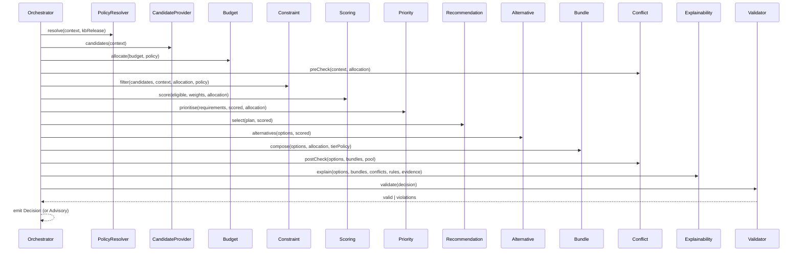

# Decision Engine — decomposed into independent engines

- **Status:** Approved design (target model)
- **Date:** 2026-07-29
- **Scope:** The core `domain_engine` (BC1 Furnishing Decision) split into independent, pure engines. No code.
- **Related:** `docs/domain_model.md`, `docs/decision_context.md`, `docs/knowledge_base.md`, `docs/furnishing_project_model.md`

---

## 0) Principles

Each engine is **independent · single-responsibility · pure · deterministic · swappable** (same interface) and **unit-testable in isolation**. The "Decision Engine" is not one class — it is an **orchestrator** composing the engines below. Given the same `(DecisionContext, Candidates, KnowledgeBaseRelease)` it always yields the same `Decision`. No engine touches AI, Flutter, Firebase, or products by class — products enter only as `Candidate` value objects via an adapter.

**Three engine roles:**
- **Providers** — bring knowledge/candidates in (`PolicyResolver`, `CandidateProvider`).
- **Transformers** — shape the decision (`Budget`, `Constraint`, `Scoring`, `Priority`, `Recommendation`, `Alternative`, `Bundle`).
- **Observers & Gates** — assess without selecting (`ConflictDetection`, `Explainability`, `DecisionValidator`).

---

## 1) The engine set

| Engine | Role | One-line responsibility |
|---|---|---|
| PolicyResolver | Provider | Resolve effective weights / distribution / rules for the context |
| CandidateProvider | Provider | Supply eligible-role `Candidate`s from the catalog (via ACL) |
| **Budget Engine** | Transformer | Allocate budget to categories; compute affordability + essentials floor |
| **Constraint Engine** | Transformer | Apply HARD constraints (filter) + emit SOFT penalties |
| **Scoring Engine** | Transformer | Compute the 5-factor `DecisionScore` per candidate |
| **Priority Engine** | Transformer | Order requirements & funding (essentials first) |
| **Recommendation Engine** | Transformer | Select & rank the individual `DecisionOption`s |
| **Alternative Engine** | Transformer | Attach ranked `Alternative`s per option |
| Bundle Engine | Transformer | Compose the 3 tiers (budget/balanced/premium) |
| **Conflict Detection Engine** | Observer | Detect budget/dimension/constraint/supply conflicts → warnings |
| **Explainability Engine** | Observer | Attach rationale / trade-offs / cited rules & evidence |
| **Decision Validator** | Gate | Verify invariants before a `Decision` is emitted |
| DecisionOrchestrator | Facade | Compose all of the above → `Decision` |

*(Bold = explicitly requested; the rest are added so the pipeline is complete and runnable.)*

---

## 2) Pipeline & data flow

```mermaid
flowchart TD
  IN[DecisionContext + KB Release + CatalogQuery] --> PR[PolicyResolver]
  IN --> CP[CandidateProvider]
  PR -->|EffectivePolicy| BUD[Budget Engine]
  BUD -->|BudgetAllocation + essentialsFloor| CD1[Conflict Detection · pre]
  CP -->|Candidate[]| CON[Constraint Engine]
  BUD --> CON
  PR --> CON
  CON -->|eligible + softPenalties| SC[Scoring Engine]
  PR --> SC
  BUD --> SC
  SC -->|ScoredCandidate[]| PRI[Priority Engine]
  PRI -->|PrioritizedPlan| REC[Recommendation Engine]
  SC --> REC
  REC -->|DecisionOption[]| ALT[Alternative Engine]
  SC --> ALT
  ALT --> BUN[Bundle Engine]
  BUD --> BUN
  BUN --> CD2[Conflict Detection · post]
  CD1 --> CD2
  CD2 -->|warnings| EXP[Explainability Engine]
  BUN --> EXP
  REC --> EXP
  EXP --> VAL[Decision Validator]
  VAL -->|valid| OUT[Decision · immutable]
  VAL -->|invalid/insufficient| ADV[Advisory Decision + warnings]
```

---

## 3) Engine specifications (input → output)

### PolicyResolver *(Provider)*
- **In:** `DecisionContext` (space size, budget flexibility), `KnowledgeBaseRelease`.
- **Out:** `EffectivePolicy { ScoringWeights, BudgetDistribution, RuleSet(active), ConstraintSet(HARD+SOFT), thresholds(Θ, priceCeilingFactor) }`.
- **Knows:** Knowledge Base. **Pure.**

### CandidateProvider *(Provider / ACL)*
- **In:** `DecisionContext` (needed `FurnitureRole`s, room type, space), `CatalogQuery`.
- **Out:** `Candidate[] { productRef, role, ProductDimensions, Money price, tags, availability, rating }`.
- **Note:** translates `CatalogProduct → Candidate`; the only boundary to the Catalog context. **Pure over a given catalog snapshot.**

### Budget Engine *(Transformer)*
- **In:** `Budget { maxTotal, flexible }`, `roomType`, `EffectivePolicy.budgetDistribution`, `RequirementSet`.
- **Out:** `BudgetAllocation { perCategoryCeiling: Map<Category,Money>, percentages, margin }`, `essentialsFloor: Money` (min cost to satisfy essentials), and an `affordability(candidate) → 0..1` function consumed by Scoring.
- **Invariant:** Σ ceilings = maxTotal − margin. **Pure.**

### Constraint Engine *(Transformer / Filter)*
- **In:** `Candidate[]`, `DecisionContext` (space dims, requirement constraints), `BudgetAllocation`, `EffectivePolicy.constraintSet`.
- **Out:** `{ eligible: Candidate[], excluded: {candidate, violatedConstraint, hardness}[], softPenalties: Map<Candidate, Penalty[]> }`.
- **Logic:** HARD → filter out (doesn't fit space, unavailable, wrong role, price > ceiling×factor, violates user constraint); SOFT → pass through as scored penalties. **Pure.**

### Scoring Engine *(Transformer)*
- **In:** `eligible Candidate[]`, `DecisionContext`, `EffectivePolicy.scoringWeights`, `BudgetAllocation`, `softPenalties`.
- **Out:** `ScoredCandidate[] { candidate, DecisionScore { roomCompatibility, budgetFit, styleMatch, qualitySignal, preferenceMatch, weightedTotal: 0..100, breakdown } }`.
- **Model:** `RoomCompat 35% + BudgetFit 30% + StyleMatch 20% + Quality 10% + Preference 5%` (weights context-adapted by policy). **Pure & deterministic.**

### Priority Engine *(Transformer)*
- **In:** `RequirementSet` (essential/optional), `ScoredCandidate[]` grouped by role, `BudgetAllocation`, `EffectivePolicy` priorities.
- **Out:** `PrioritizedPlan { orderedRequirements: Requirement[] (essentials-first), fundingOrder, perRequirementBudgetClaim: Map, deferred: Requirement[] }`.
- **Decides:** which requirements are funded first and how much budget each may claim; what to defer when budget is tight. **Pure.**

### Recommendation Engine *(Transformer — core selection)*
- **In:** `PrioritizedPlan`, `ScoredCandidate[]` (by role), `DecisionContext`.
- **Out:** `DecisionOption[] { productRef, role, Money price, Priority, DecisionScore }` — top pick(s) per prioritized requirement, ranked overall (rationale added later).
- **Pure.**

### Alternative Engine *(Transformer)*
- **In:** `DecisionOption[]` (chosen), `ScoredCandidate[]` (by role, minus chosen), `maxAlternatives`.
- **Out:** per option, `Alternative[] { productRef, Money price, DecisionScore, scoreDeltaVsChosen }` — ranked next-best for the same role, enabling swaps.
- **Pure.**

### Bundle Engine *(Transformer / Composer)*
- **In:** `DecisionOption[]` + alternatives, `ScoredCandidate[]`, `BudgetAllocation`, `Budget`, `EffectivePolicy.tierPolicy`.
- **Out:** `Bundle[3] { tier, options[], Money total, exceedsBudget, provisionalTradeoffs }`.
- **Strategy:** budget = cheapest viable essentials; balanced = best-score within budget; premium = highest quality (may exceed → flagged). **Pure.**

### Conflict Detection Engine *(Observer)*
- **In (pre):** `DecisionContext`, `BudgetAllocation`, `essentialsFloor`. **In (post):** assembled `DecisionOption[]`/`Bundle[]`, eligible pool.
- **Out:** `Conflict[] / DecisionWarning[] { type, severity, affected, suggestedResolution }` — types: `BudgetConflict` (budget < essentialsFloor), `DimensionImplausible`, `ConstraintContradiction`, `InsufficientCandidates`, `OverBudgetPremium`.
- **Observer only** — detects, never mutates selection; the orchestrator decides the response (e.g., advisory fallback). **Pure.**

### Explainability Engine *(Observer / Annotator)*
- **In:** `DecisionOption[]`, `Bundle[]`, `Conflict[]`, each option's `DecisionScore` + the **fired rule ids** + KB **evidence refs**.
- **Out:** enriched `Rationale` per option (dominant factors + governing rules), per bundle (reason, top trade-off, top feature), and human-readable conflict explanations — all **traceable to rule/evidence versions**.
- **Read-only** over the decision; adds explanation VOs. **Pure.**

### Decision Validator *(Gate)*
- **In:** the fully-assembled `Decision { options, bundles, warnings, allocation, pinned ContextVersion + PolicyVersion }`.
- **Out:** `ValidationResult { valid: bool, violations: InvariantViolation[] }`.
- **Checks:** essentials satisfied (or explicitly warned); no HARD constraint violated in any emitted option/bundle; Σ allocation = budget; bundle totals correct; every option references an eligible candidate; versions pinned; non-empty (or carries a fallback warning).
- **Gate:** a `Decision` is **never emitted while invalid** — orchestrator repairs or downgrades to advisory. **Pure.**

### DecisionOrchestrator *(Facade)*
- **In:** `DecisionContext` (decision-ready or proceeded-with-gaps), `CatalogQuery`, `KnowledgeBaseRelease`.
- **Out:** `Decision` (immutable) **or** `AdvisoryDecision` (fallback) — never throws for domain conditions; conflicts become warnings.
- Composes all engines; each is injected & replaceable. **Deterministic** given inputs + versions.

---

## 4) Orchestration sequence



---

## 5) Error & fallback model

- Engines **never throw for domain conditions** (empty pool, over-budget) — they return data (`excluded`, `warnings`, `exceedsBudget`).
- `InsufficientCandidates` or validator failure → **AdvisoryDecision**: general guidance + warnings + `ask_for_images` / `re-prioritise` suggestions, never a silent empty result.
- Only genuine programming errors surface as exceptions (caught at the orchestrator → `Failure`).

---

## 6) Determinism, versioning, testability

- Every engine is a **pure function**; the pipeline is reproducible.
- A `Decision` **pins** its `ContextVersion` + `KnowledgeBaseRelease` → identical replay.
- Each engine is unit-tested in isolation (fixtures of candidates/context/policy); the orchestrator is tested for wiring + fallback.

---

## 7) Invariants

1. Engines are **pure & side-effect-free**; no I/O, no clock, no randomness (seeds/ids injected).
2. Selection engines never violate a HARD constraint; the **Validator** is the final gate.
3. Essentials are prioritised and funded before optionals.
4. Conflicts are **warnings/observations**, not exceptions.
5. Explanations cite **versioned** rules/evidence; no unexplained option in the output.

---

## 8) Mapping to current code (evolution, not rewrite)

| Engine | Today | Action |
|---|---|---|
| Scoring | `recommendation/scoring.dart` | **Keep** (already isolated) |
| Budget | `budget/budget_allocator.dart` | **Keep**; add `essentialsFloor` + affordability |
| Constraint | filter logic embedded in `recommendation_engine.dart` | **Extract** into its own engine |
| Priority | essentials-first embedded in `recommendation_engine.dart` | **Extract** |
| Recommendation | `_buildIndividual` | **Keep** (slimmed to selection only) |
| Bundle | `_buildBundles` | **Extract** into its own engine |
| PolicyResolver | `ScoringWeights.forContext` + distributions | **Extract/rename** |
| CandidateProvider | `CatalogRepository` + filtering | **Formalise** the adapter |
| Conflict Detection | partial (business rules + fallback) | **Consolidate** into one engine |
| Explainability | `_reasonFor` (basic) | **Grow** to cite rules/evidence |
| Alternative | — | **New** |
| Decision Validator | — | **New** (final gate) |

Net: **extract 4 embedded concerns, formalise 2 providers, grow 2 observers, add 2 new engines** — all behind the existing deterministic `domain_engine`, preserving behavior.
