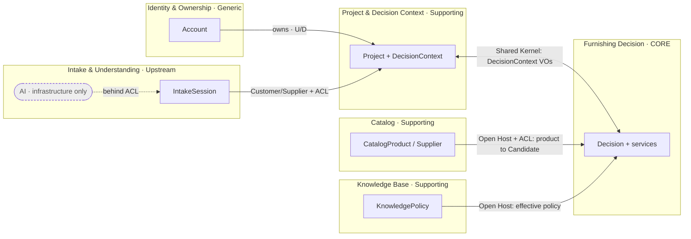
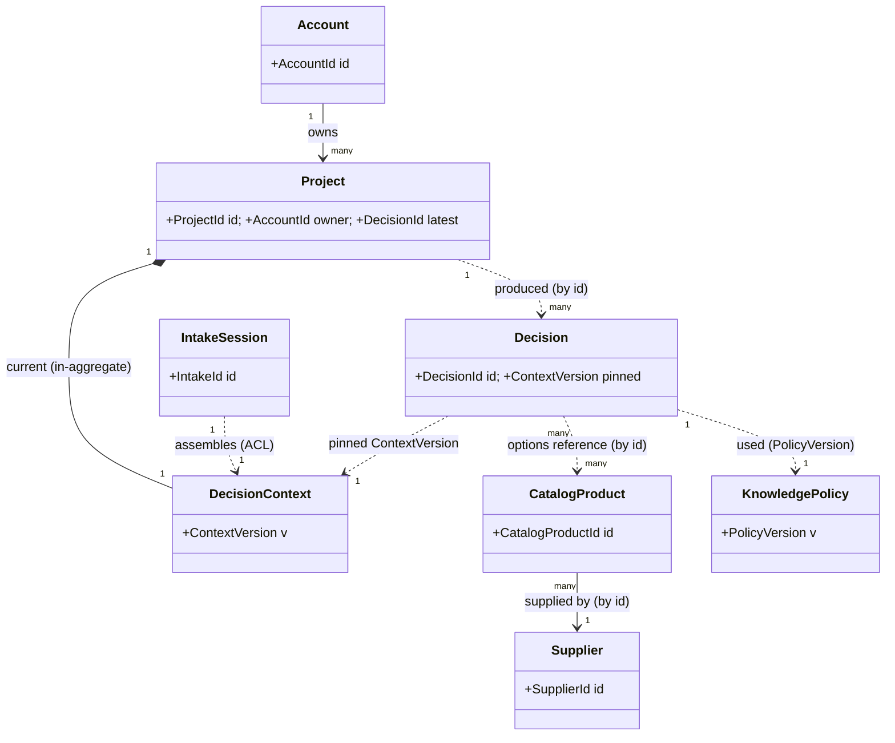

# Domain Model — Furniture Decision System (نظام قرارات التأثيث)

- **Status:** Approved design (target model)
- **Date:** 2026-07-29
- **Scope:** Pure DDD domain model. Technology-agnostic; **AI lives outside the domain** behind an Anti-Corruption Layer.
- **Related:** `docs/adr/0001-mvp-architecture-decisions.md`, `docs/project-understanding-and-mvp.md`, `docs/decision_context.md`, `docs/furnishing_project_model.md`, `docs/knowledge_base.md`

---

## 0) Modeling principles (the invariants that shape everything)

1. **The core domain is decision-making, not data or AI.** The heart is turning a *decision problem* + *candidate products* + *knowledge* into a *Decision*.
2. **AI is not a domain concept.** It is an implementation detail of the *Intake & Understanding* context, hidden behind an ACL. The domain never "calls AI"; it receives an already-structured `ExtractionResult`.
3. **Completeness and clarification are domain rules, not AI features.** *What* counts as a gap and *which* clarification to raise are `Domain Services`. AI merely phrases/surfaces them.
4. **Small aggregates, reference across boundaries by identity** (never by object graph).
5. **A Decision is an immutable result** computed from one `ContextVersion`; re-deciding mints a new Decision.

---

## 1) Ubiquitous Language (bilingual — Arabic-first product)

| Term (EN) | المصطلح (AR) | Meaning |
|---|---|---|
| Furnishing Decision System | نظام قرارات التأثيث | The whole domain: helping a user decide how to furnish a space |
| Project | مشروع | A saved furnishing effort for one space, owned by a user |
| Decision Context (Brief) | سياق القرار | The fully-specified problem: Space + Budget + Style + Requirements + Gaps |
| Space | الحيّز/الغرفة | The room to furnish (type + dimensions) |
| Budget | الميزانية | Monetary ceiling + flexibility |
| Style Profile | ملف النمط | Preferred styles/colors/materials + aversions |
| Requirement | متطلَّب | A needed furniture role (essential/optional) with constraints & quantity |
| Furniture Role | دور الأثاث | The kind of piece needed (bed, sofa, storage, …) |
| Gap / Missing Info | فجوة/نقص | A required part of the context that is absent or uncertain |
| Confidence | الثقة | How complete/certain the context is (0..1) |
| Clarification | استيضاح | A follow-up question targeting a specific gap |
| Catalog Product | منتج الكتالوج | A real furniture item with attributes |
| Candidate | مرشَّح | A catalog product evaluated *for a specific context* |
| Compatibility | التوافق | Computed fit of a candidate to space/budget/style |
| Decision Score | درجة القرار | Weighted evaluation of a candidate (5 factors) |
| Decision Option | خيار القرار | A chosen candidate for a requirement (rationale, priority, score) |
| Bundle | باقة | A coordinated set of options at a tier, with total, trade-offs, rationale |
| Trade-off | تنازل | An explicit compromise inside a bundle |
| Budget Allocation | توزيع الميزانية | Distribution of budget across categories per space type |
| Knowledge Policy | سياسة المعرفة | Versioned weights/distributions/rules governing decisions |
| Decision | القرار | The immutable result: ranked options + bundles + warnings |

> Naming shift adopted from the audit: **"Recommendation" → "Decision Option"**, **"RecommendationEngine" → the Decision domain services**. Function unchanged.

---

## 2) Bounded Contexts

| # | Bounded Context | Type | Core Responsibility |
|---|---|---|---|
| BC1 | **Furnishing Decision** | **Core Domain** | Produce a `Decision` from a context + candidates + policy (the "Domain Engine") |
| BC2 | **Project & Decision Context** | Supporting | Own the decision problem's lifecycle and its evolution via clarifications |
| BC3 | **Catalog** | Supporting | Own product/supplier reference data; supply candidates |
| BC4 | **Knowledge Base** | Supporting | Own the decision *policy*: weights, distributions, compatibility rules, taxonomy |
| BC5 | **Intake & Understanding** | Upstream / ACL | Turn raw user input into a structured `ExtractionResult` (AI hidden here) |
| BC6 | **Identity & Ownership** | Generic | Users/accounts owning projects (anonymous allowed) |

---

## 3) Context Map

**Integration patterns:**

| Relationship | Pattern | Notes |
|---|---|---|
| Intake → Project | **Customer/Supplier + ACL** | `ContextAssembler` protects the domain from raw extraction shape |
| Project ↔ Decision (core) | **Shared Kernel** | Both share the `DecisionContext` + shared VOs; Project is customer, core is supplier |
| Catalog → Decision | **Open Host Service + ACL** | Catalog exposes candidate queries; core translates `CatalogProduct` → `Candidate` |
| Knowledge → Decision | **Open Host Service (Conformist)** | Core reads effective `ScoringWeights`/`BudgetDistribution` |
| Identity → Project | **Upstream/Downstream** | Ownership only; generic |

---

## 4) Domain Model per Bounded Context

### BC1 — Furnishing Decision *(Core)*

- **Aggregate Root — `Decision`**: the immutable outcome for one `ContextVersion`. Holds ranked `DecisionOption`s, `Bundle`s, `DecisionWarning`s, and the `BudgetAllocation` used. *Invariants:* essentials are satisfied before optionals; no option violates an essential; immutable after creation.
- **Entities:** none besides the root (deliberately — results are value-typed).
- **Value Objects:**
  - `Candidate` — transient pairing of a product reference + its `Compatibility` + `DecisionScore` for *this* context.
  - `Compatibility` — fits-space? / budget-fit degree / style-match degree.
  - `DecisionScore` — composite of five `ScoreFactor`s (RoomCompatibility, BudgetFit, StyleMatch, QualitySignal, PreferenceMatch) + weighted total.
  - `ScoreFactor` — {name, value 0..1, weight}.
  - `DecisionOption` — {productRef, role, `Money` price, `Priority`, `Rationale`, `DecisionScore`}; immutable.
  - `Bundle` — {`BundleTier`, options[], `Money` total, `Rationale`, `TradeOff`[], designNotes[], exceedsBudget}.
  - `BundleTier` — budget | balanced | premium.
  - `TradeOff`, `Rationale`, `DecisionWarning`, `BudgetAllocation`.
- **Domain Services:**
  - `EligibilityService` — filters out ineligible candidates (wrong role, doesn't fit, unavailable, violates constraint, price beyond sane category limit).
  - `CompatibilityEvaluator` — computes `Compatibility`.
  - `DecisionScorer` — computes `DecisionScore` using policy weights + context.
  - `BudgetAllocator` — computes `BudgetAllocation` from the space's `BudgetDistribution`.
  - `BundleComposer` — assembles tiered bundles honoring allocation + essential-priority.
  - `DecisionAssembler` — orchestrates filter → score → rank → allocate → compose → warnings, emitting the `Decision`.
- **Domain Events:** `DecisionRequested`, `DecisionProduced`, `BudgetConflictDetected`, `InsufficientCandidatesDetected` (→ advisory fallback).

### BC2 — Project & Decision Context *(Supporting)*

- **Aggregate Root — `Project`**: owns the problem lifecycle; references the latest produced `DecisionId`; owned by an `AccountId`. *Invariant:* always has exactly one current `DecisionContext`.
- **Entity (non-root) — `DecisionContext`**: the mutable brief, carrying a `ContextVersion`. Evolves as clarifications are answered.
- **Value Objects:** `Space`, `RoomType`, `Budget`, `StyleProfile`, `Requirement`, `RequirementSet`, `Priority`, `Constraint`, `Gap`, `GapSet`, `ContextConfidence`, `ContextVersion`.
- **Domain Services:** `GapDetectionService` (completeness rules), `ClarificationPlanner` (which questions to raise). *Both are domain, not AI.*
- **Domain Events:** `ProjectStarted`, `DecisionContextUpdated`, `DecisionContextReady`, `ProjectSaved`, `ProjectReopened`.

### BC3 — Catalog *(Supporting)*

- **Aggregate Roots:** `CatalogProduct` and `Supplier`.
- **Value Objects:** `Category`, `ProductDimensions`, `AvailabilityStatus`, `Rating`, tags, `Money`/`Currency`. *Invariants:* valid dimensions, non-negative price, consistent category.
- **Domain Services:** `CandidateProvider` (select relevant products), `CatalogQualityPolicy` (validate quality criteria).
- **Domain Events:** `ProductAdded`, `ProductUpdated`, `AvailabilityChanged`, `PriceChanged`.

### BC4 — Knowledge Base *(Supporting)*

- **Aggregate Root — `KnowledgePolicy`** (versioned). *Invariants:* `ScoringWeights` sum to 1; each `BudgetDistribution` sums to 1.
- **Value Objects:** `ScoringWeights`, `BudgetDistribution`, `CompatibilityRule`/`RuleSet`, `StyleTaxonomy`, `RoleMapping`, `PolicyVersion`.
- **Domain Services:** `PolicyResolver` — resolves effective weights/distribution for a context.
- **Domain Events:** `PolicyPublished`, `PolicyVersioned`.
- **See** `docs/knowledge_base.md` for the full ontology.

### BC5 — Intake & Understanding *(Upstream / ACL — AI hidden here)*

- **Aggregate Root — `IntakeSession`**: one attempt to understand raw input.
- **Value Objects:** `RawInput`, `ExtractionResult` (proposed `DecisionContext` + `Confidence` + `GapSet`), `Clarification`, `ClarificationSet`, `Confidence`.
- **Domain Services:** `ContextAssembler` (ACL: translate `ExtractionResult` → valid `DecisionContext`).
- **Domain Events:** `InputReceived`, `ContextExtracted`, `ClarificationRequested`, `ClarificationAnswered`, `ContextConfirmed`.

### BC6 — Identity & Ownership *(Generic)*

- **Aggregate Root — `Account`** (UserId, anonymous allowed). Events: `AccountRegistered`, `AnonymousSessionStarted`.

---

## 5) Aggregate Roots — consolidated

| Aggregate Root | Boundary contains | Key Invariant | Cross-aggregate refs (by id) |
|---|---|---|---|
| `Project` | `DecisionContext` (entity) + its VOs | exactly one current context; version bumps on change | `AccountId`, latest `DecisionId` |
| `Decision` | option/bundle/warning/allocation VOs | essentials-first; immutable; pinned to one `ContextVersion` | `ProjectId`, `ContextVersion`, `CatalogProductId`s, `PolicyVersion` |
| `CatalogProduct` | product VOs | valid dimensions/price/category | `SupplierId` |
| `Supplier` | supplier VOs | — | — |
| `KnowledgePolicy` | policy VOs | weights sum=1; distributions sum=1 | — |
| `IntakeSession` | raw input / extraction / clarifications VOs | extraction maps only to valid domain values (ACL) | produces a `DecisionContext` for a `ProjectId` |
| `Account` | identity VOs | — | — |

**Every Domain Entity:** `Project`, `DecisionContext` *(non-root)*, `Decision`, `CatalogProduct`, `Supplier`, `KnowledgePolicy`, `IntakeSession`, `Account`. *(Everything else is a Value Object.)*

---

## 6) Entity Relationships

**Reference rules:** solid `*--` = inside an aggregate boundary; dotted `..>` = cross-aggregate reference **by identity only**. A `Decision` never embeds `CatalogProduct` objects — only `CatalogProductId` + a snapshot of price/role captured at decision time.

---

## 7) Relationship to current code

This model is **compatible with the existing implementation** and is adopted by **renaming + naming two currently-implicit concepts** (`DecisionContext`, `KnowledgePolicy`) — not a rewrite:

| Model concept | Current code |
|---|---|
| `Project` | `FurnishingProject` (`lib/shared/models/`) |
| BC1 domain services | `lib/domain_engine/` (business rules, scoring, budget) |
| Value Objects | the `json_schema`-based models |
| Catalog | `lib/shared/services/catalog_repository.dart` + asset |
| Intake & Understanding (ACL) | `lib/ai/` (mock-first) |
