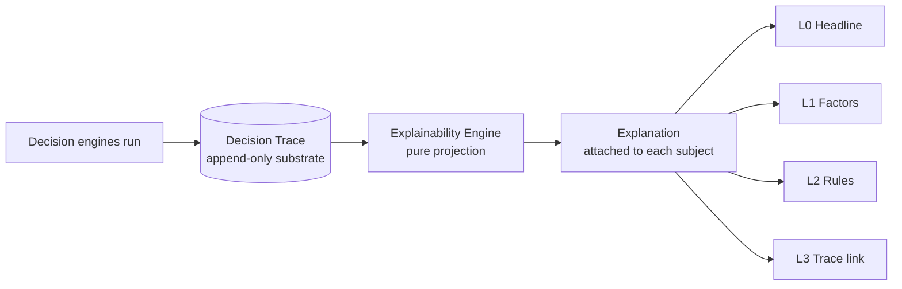
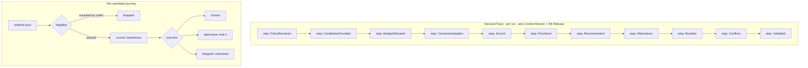
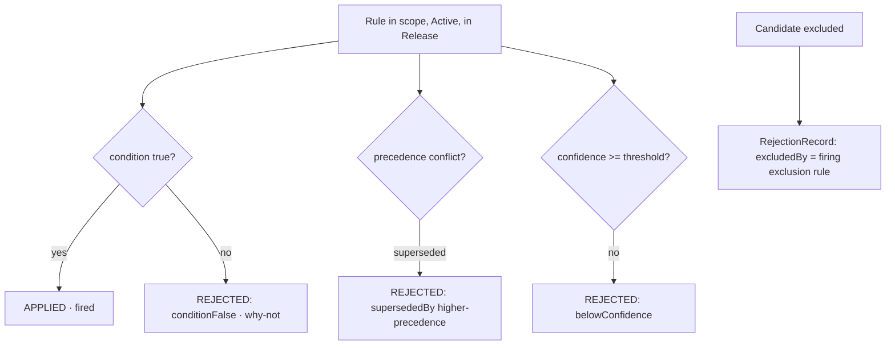
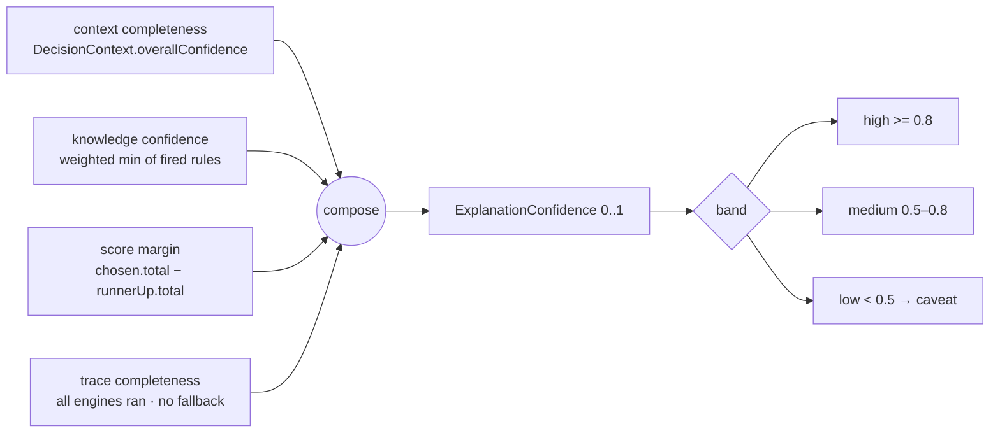
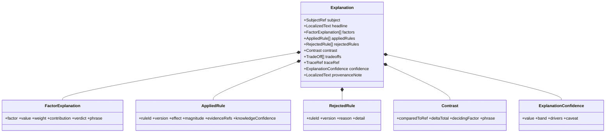

# Explainability — every recommendation explains WHY

- **Status:** Approved design (target model)
- **Date:** 2026-07-29
- **Scope:** How every decision output is explained, traceably and faithfully. No code.
- **Related:** `docs/decision_engine.md`, `docs/knowledge_base.md`, `docs/decision_context.md`, `docs/domain_model.md`

---

## 0) Principles

1. **Faithful, not post-hoc.** An explanation is a **projection of the actual Decision Trace** — never an independently generated story. If it wasn't in the trace, it can't be in the explanation. (This also keeps explanations **AI-free**: templated projection, fully deterministic.)
2. **Traceable.** Every claim cites a **versioned** rule id + evidence ref + score factor.
3. **Contrastive.** The strongest explanation is *"chosen over X because Y"* — relative to the runner-up/alternatives.
4. **Layered (progressive disclosure):** headline → factors → rules → full trace.
5. **Deterministic & auditable.** Same `(context, candidates, KB release)` → same explanation; the trace is stored and replayable.



---

## 1) Explanation Model

An **Explanation** attaches to every *explainable subject*: each `DecisionOption`, each `Bundle`, each `Alternative`, each `Warning/Conflict`, each `Clarification`, and the `Decision` as a whole.

| Subject | Explanation type | Answers |
|---|---|---|
| DecisionOption | `WhyChosen` / `WhyRanked` | why picked, why at this rank |
| Excluded candidate | `WhyExcluded` | which rule rejected it |
| Alternative | `WhyAlternative` | why runner-up, delta vs chosen |
| Bundle | `WhyBundled` | why these items at this tier, trade-offs |
| Warning/Conflict | `WhyWarned` | what conflicts and the suggested fix |
| Clarification | `WhyAsked` | which gap triggered the question |

Each Explanation has four **levels**: **L0** headline · **L1** factor breakdown · **L2** applied/rejected rules · **L3** link into the full trace.

---

## 2) Decision Trace *(the substrate)*

The trace is the **append-only source of truth**, written by the engines as they run; the explanation is derived from it.



- **TraceStep** `{ engine, phase, inputsDigest, outputsDigest, firedRules[], notes }`.
- **CandidateTrace** `{ productRef, role, eligibility{passed, excludedBy?}, score?, outcome: chosen|alternative(rank)|dropped(reason), journey: TraceEvent[] }`.
- Immutable, versioned, replayable → enables both *"why chosen"* **and** *"why this other product was not"*.

---

## 3) Applied Rules

Rules whose condition was **true** and that **changed** the outcome (fired).

```
AppliedRule {
  ruleId, version, domain,               // KA-SP1 · v2 · KD1
  effect: exclude|penalize|boost|allocate|prioritize,
  magnitude,                             // e.g. -0.2 style penalty, 40% allocation
  statement: LocalizedText,              // human phrasing of the rule
  evidenceRefs[], knowledgeConfidence    // grade A/B/C, 0..1
}
```
Grouped by effect so the reasoning can say *"eligible because … · scored high because … · funded first because …"*.

---

## 4) Rejected Rules

Two complementary things, both surfaced for transparency:



- **RejectedRule** `{ ruleId, version, reason: conditionFalse | supersededBy(otherRuleId) | belowConfidence | outOfScope | deprecated, detail }` — powers *"we did **not** exclude/penalise it for X, because …"* and shows the system weighed alternatives.
- **RejectionRecord** (candidate-level) — for every excluded product, the **single firing HARD rule** that rejected it → powers `WhyExcluded` (*"not suggested because its footprint exceeds 60% of the room — rule KA-SP1"*).

---

## 5) Confidence *(of the explanation)*

Distinct from *context* confidence and *knowledge* confidence — this is **how much to trust this specific decision/explanation**:



Low confidence attaches a **caveat** to the reasoning (*"based on an assumed room height; confirm to strengthen"*) and, if driven by inferred inputs, a **provenance note**.

---

## 6) Reasoning *(the human-facing narrative)*

Generated by **projecting the trace through deterministic templates** (Arabic-first) — no free-text generation, so it's faithful and reproducible. It is **contrastive** and **layered**:

| Layer | Content | Example (ar) |
|---|---|---|
| **L0 Headline** | one dominant reason | «اخترناه لأنه يناسب المساحة وضمن ميزانية فئة السرير.» |
| **L1 Factors** | score breakdown, which factor dominated | «توافق الغرفة 35٪ (ممتاز) · ملاءمة الميزانية 30٪ (جيد).» |
| **L2 Rules** | applied + notable rejected | «طُبّقت: قاعدة التوافق المكاني KA-SP1 · لم تُطبّق قاعدة الاستبعاد لأن القطعة تدخل المساحة.» |
| **Contrast** | vs runner-up | «فُضّل على السرير الفاخر (1250) لأنه أوفر ضمن الفئة بفارق الدرجة.» |
| **Caveat** | confidence/provenance | «الأبعاد مُدخلة يدويًا ← ثقة عالية.» |

**Reasoning templates** are keyed to `(factor|effect|ruleDomain)` → phrase, so every phrase is traceable to a trace element. No template ⇒ no claim.

---

## 7) Output Schema

**Per-recommendation Explanation:**



**Decision-level Explanation:** `{ summary, budgetReasoning, priorityReasoning, explainedConflicts[], overallConfidence, traceRef }`.

**Concrete JSON-shaped schema** (attached under each `recommendations.individual_items[i]` and `bundles[i]`):
```
"explanation": {
  "headline": "string (ar)",
  "factors": [
    {"factor":"room_fit","value":0.0,"weight":0.35,"contribution":0.0,"verdict":"strong|adequate|weak","phrase":"string"}
  ],
  "applied_rules": [
    {"rule_id":"KA-SP1","version":"2.0.0","effect":"exclude|penalize|boost|allocate|prioritize",
     "magnitude":0.0,"statement":"string","evidence_refs":["EV-.."],"knowledge_confidence":0.0}
  ],
  "rejected_rules": [
    {"rule_id":"KA-SP1x","version":"1.0.0","reason":"condition_false|superseded_by|below_confidence|out_of_scope|deprecated","detail":"string"}
  ],
  "contrast": {"compared_to":"product_id","delta_total":0.0,"deciding_factor":"budget_fit","phrase":"string"},
  "tradeoffs": ["string"],
  "trace_ref": {"trace_id":"..","steps":["scored","recommended"]},
  "confidence": {"value":0.0,"band":"high|medium|low",
     "drivers":{"context":0.0,"knowledge":0.0,"score_margin":0.0,"trace":0.0},
     "caveat":"string?"},
  "provenance_note": "string?"
}
```

---

## 8) Worked example — *"why this bed?"*

Context: bedroom 4×6 m, budget 1800, essentials {bed, sofa}, style modern (all manual).

| Layer | Output |
|---|---|
| Headline | «اخترنا *سرير مزدوج بسيط* لأنه يدخل المساحة بأريحية، وضمن سقف فئة السرير، ومتوافق مع النمط المودرن.» |
| Factors | room_fit 1.0×0.35 **(strong, dominant)** · budget_fit 0.72×0.30 · style_match 1.0×0.20 · quality 0.88×0.10 |
| Applied rules | `KA-SP1`(fit ✓) · `KA-BUD3`(≤ category ceiling) · `KA-ST1`(modern affinity) · `KA-PRIO1`(essential funded first) |
| Rejected rules | `KA-SP1x`(oversized) → *condition_false* (it fits) |
| Contrast | «فُضّل على *سرير كوين فاخر* (1250) — deciding_factor: budget_fit، فارق الدرجة +11.» |
| Confidence | **high (0.9)** — context complete, high-grade rules, clear margin |

---

## 9) Invariants

1. **No unexplained output** — every emitted `DecisionOption`/`Bundle`/`Warning` carries an `Explanation`.
2. **Faithfulness** — every explanation claim maps to a `TraceEvent`/`AppliedRule`; nothing invented.
3. **Traceability** — rule + evidence citations are **version-pinned** to the KB release used.
4. **Determinism** — explanations are pure projections; identical inputs → identical text.
5. **Contrast present** whenever a runner-up exists.
6. Low confidence ⇒ caveat/provenance note is mandatory.

---

## 10) Mapping to current code

Today: `lib/domain_engine/recommendation/recommendation_engine.dart` `_reasonFor()` produces a one-line reason only — the **L0 headline**, no trace, no rule citations. Evolution:
1. Engines write a **`DecisionTrace`** as they run.
2. A pure **Explainability Engine** projects it into the `Explanation` schema.
3. Rules gain ids/versions/evidence from the **Knowledge Base**.

Additive — the existing headline becomes **L0** of a richer object; nothing is rewritten.
