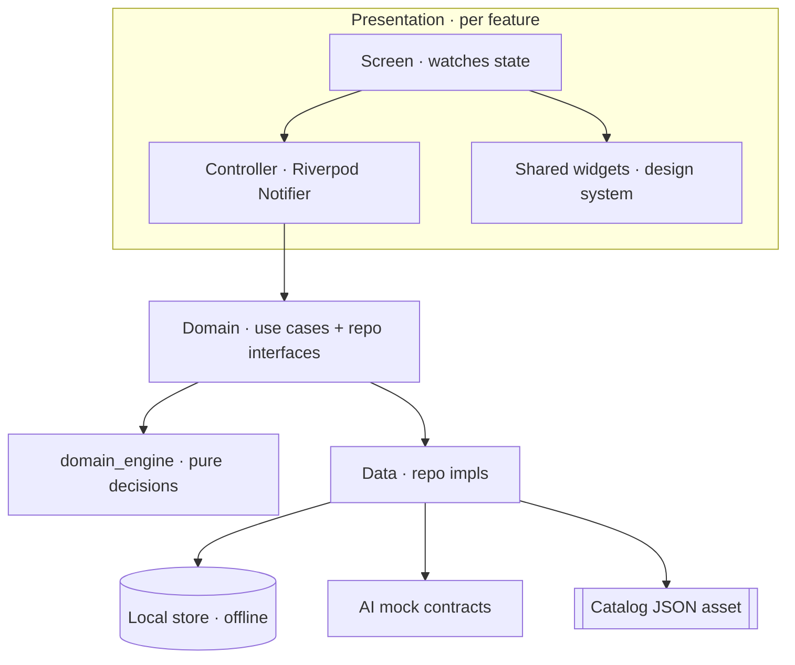
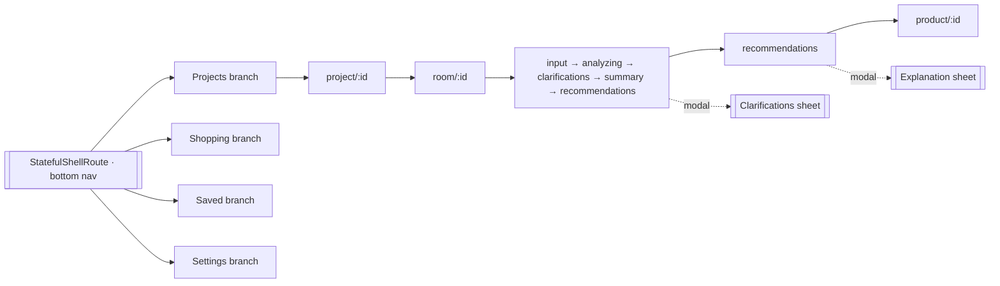
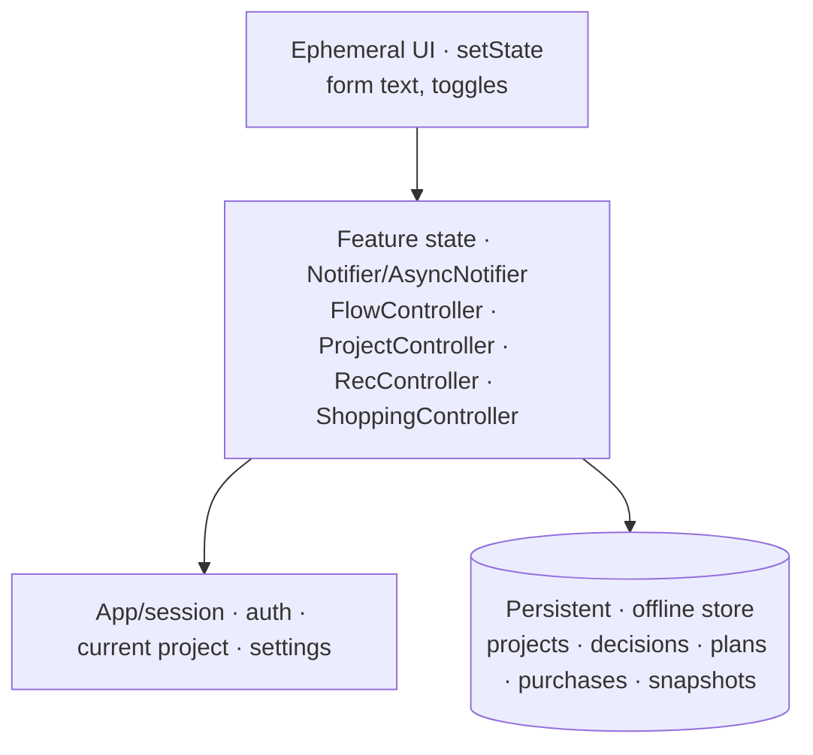

# Flutter client — presentation architecture

- **Status:** Approved design (target model)
- **Date:** 2026-07-29
- **Scope:** The on-device Flutter app: screens, navigation, state, architecture, offline, localization, accessibility. **No backend.** No implementation.
- **Related:** `docs/adr/0001-mvp-architecture-decisions.md`, `docs/furnishing_project_model.md`, `docs/decision_context.md`, `docs/recommendation_engine.md`, `docs/explainability.md`

> On-device only. Everything runs locally: bundled catalog, mock AI, local persistence. Arabic-first (RTL), feature-first Clean Architecture. Business logic stays in `domain_engine`; widgets stay dumb.

---

## 1) Architecture (presentation within Clean Architecture)

- **Screens are dumb:** watch a controller's `AsyncValue`, render, dispatch intents. **Zero business logic in widgets.**
- Presentation depends **only on domain** (via providers); data/impls injected. Same feature-first tree as today (`lib/features/<f>/{presentation,domain,data}` + `shared/` + `core/`).
- Responsive: phone-first; tablet = master–detail (`project → room`) via breakpoints.

---

## 2) Screens (inventory · MVP vs target)

| Area | Screens | Status |
|---|---|---|
| **Onboarding/Identity** | splash · onboarding intro · anonymous session | ✓ MVP (mock auth) |
| **Projects** | project list (home) · create project · project detail (rooms + budget rollup + timeline + state) | target |
| **Rooms** | room list · add room · **input method** · **manual input** (context editor) · **voice** · **images** · room geometry capture (doors/windows/obstacles) | ✓ input screens; geometry = target |
| **Analysis** | analyzing · **clarifications** (follow-ups) · **request summary** | ✓ MVP |
| **Recommendations** | **overview (Products / Packages tabs)** · product detail + explanation · alternatives · package detail · priority (buy-first) | ✓ overview; rest target |
| **Shopping/Budget** | shopping plan · item detail · purchases · budget breakdown | target |
| **History** | **saved projects** · snapshots · compare snapshots | ✓ saved; rest target |
| **Cross-cutting** | explanation sheet (why) · settings (language, a11y, about) · error/empty/**offline** states | partial |

---

## 3) Navigation (GoRouter)

- **Shell + branches** (bottom nav: Projects · Shopping · Saved · Settings), each with its **own nested stack** (state preserved per tab).
- **Linear sub-flow** inside a room (input → analysis → recommendations); **modals/sheets** for clarifications + explanations.
- **Guards:** onboarding-complete + anonymous-session redirects. **Deep links:** `/project/:id/room/:id`. Typed route names.
- *MVP today is the linear flow only; the shell is the target wrapper — additive.*

---

## 4) State (Riverpod)

- **Four tiers:** ephemeral (local) → feature (Riverpod controllers) → session (auth/current project/settings) → persistent (local store).
- Every async operation is an **`AsyncValue`** (`initial/loading/success/error`) — the UI renders the four states uniformly.
- The existing **`FurnishingFlowController`** drives the room journey; add `ProjectController`, `RecommendationsController`, `ShoppingController`. Controllers call use cases → `domain_engine`/repos; **optimistic updates** for saves.
- Providers overridable (mock ↔ real) — the DI story from `adr/0001`.

---

## 5) Offline (offline-first · no backend)

- **All core flows work with zero network.** Catalog = bundled JSON asset; AI = **mock** (offline); manual input path always available.
- **Local persistence** behind repositories: a `LocalStore` abstraction (impl TBD — Hive/Isar/sqflite/drift), durable across restarts. Today's `InMemoryProjectRepository` → `LocalProjectRepository` (single swap, interfaces unchanged).
- **Single device ⇒ no sync conflicts.** Firebase/cloud sync is a **later additive layer** (deferred; not now).
- **Future real AI** (network) degrades gracefully: cache last decision, offline banner, fall back to manual/advisory — never blocks.

---

## 6) Localization (Arabic-first)

- **RTL by default** (`locale: ar`; `Directionality` rtl). Optional `en`.
- **Migrate** `AppStrings` (static) → **ARB / `gen-l10n`** (`l10n/app_ar.arb` primary + `app_en.arb`); keep enum `arabicLabel` for controlled-vocab display.
- **Direction-aware widgets:** `EdgeInsetsDirectional`, `AlignmentDirectional`, start/end (never left/right).
- **Formatting:** `intl` for **SAR** + optional Arabic-Indic digits + dates.
- **Font:** bundle an Arabic face (Cairo/Tajawal).
- **Locale switch** in Settings, persisted.

---

## 7) Accessibility (app UI — distinct from room accessibility)

| Concern | Design |
|---|---|
| Screen readers | `Semantics` labels on icons/buttons; meaningful **RTL-aware reading order**; Arabic TalkBack/VoiceOver tested |
| Dynamic type | respect `MediaQuery.textScaler`; no fixed heights that clip |
| Contrast | WCAG **AA**; never color-only (icon **+** text) |
| Touch targets | ≥ **48 dp** |
| Focus/keyboard/switch | logical `FocusTraversalGroup`, RTL order |
| Announcements | `SemanticsService.announce` for errors/results (live regions) |
| Reduced motion | honor `MediaQuery.disableAnimations` |
| Cognitive | **explanations** ("why") + summaries aid comprehension; **voice input** aids motor access |

---

## 8) Invariants
1. **No business logic in widgets** — controllers + `domain_engine` own it.
2. Presentation depends only on **domain** (via providers); no direct data/AI imports in screens.
3. App is **fully functional offline**; network is never required for a decision.
4. **RTL + Arabic-first** everywhere; direction-aware layout only.
5. Every screen handles the four `AsyncValue` states + an **accessible** empty/error/offline state.

---

## 9) Mapping to current code
Built today: 8 screens, `FurnishingFlowController` + providers, flat `GoRouter`, `AppStrings` + `locale ar` + RTL, `InMemoryProjectRepository`, bundled catalog, shared widgets. **Evolution (additive):** wrap routes in a `StatefulShellRoute` (bottom nav); add Project/Shopping/Detail/Explanation/Settings screens + their controllers; swap in `LocalProjectRepository`; migrate `AppStrings`→ARB; run a semantics/contrast/dynamic-type pass. No rewrite.
