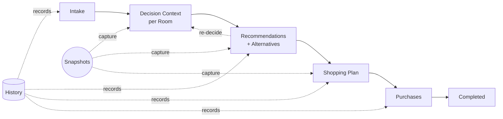
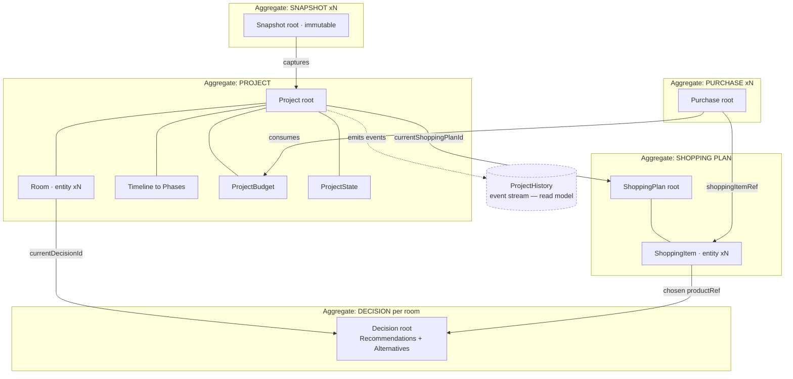
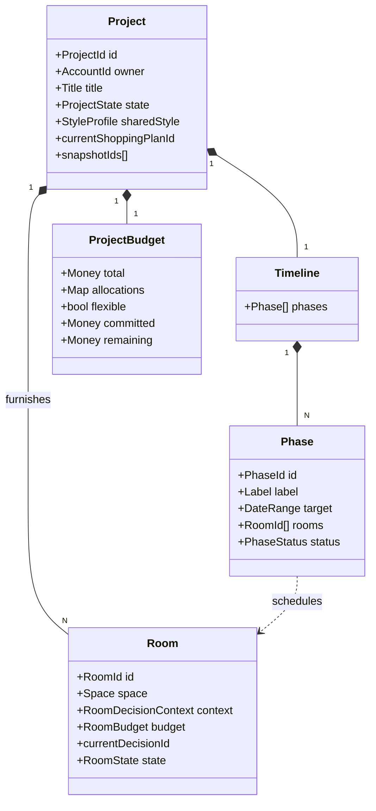
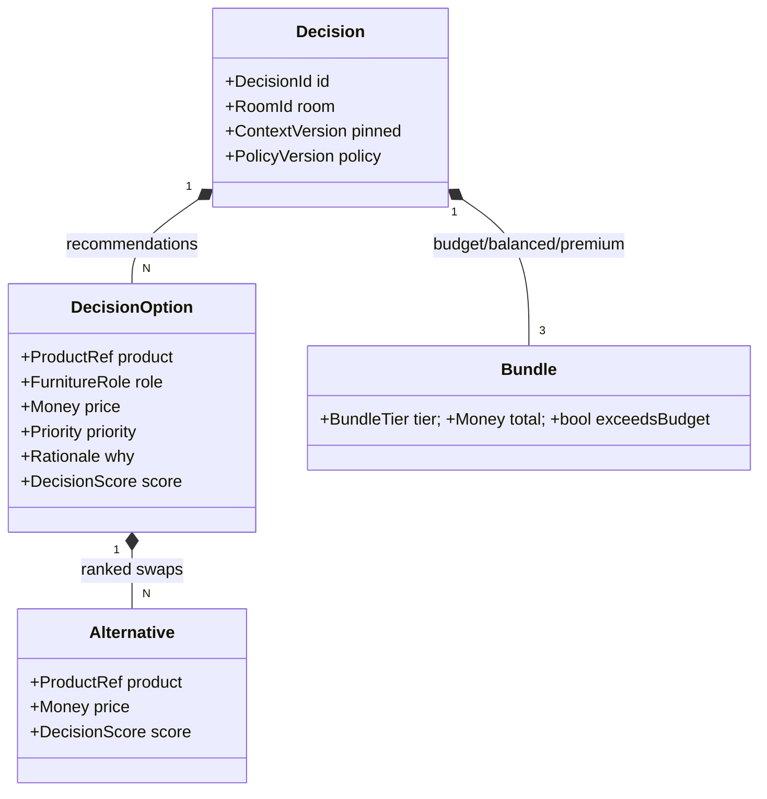
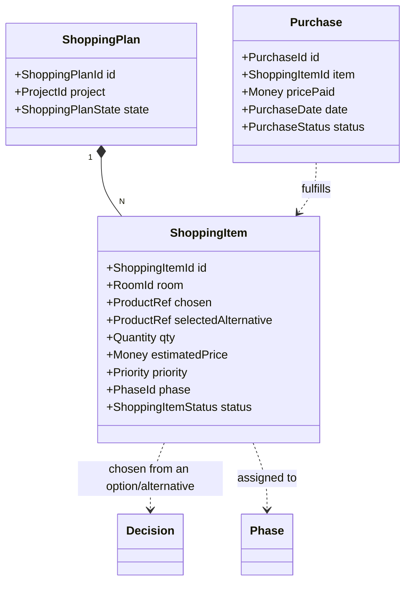
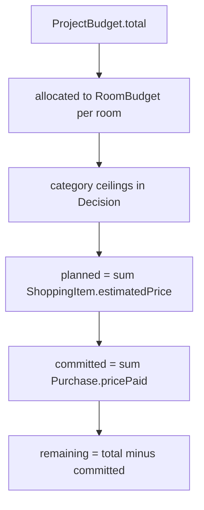
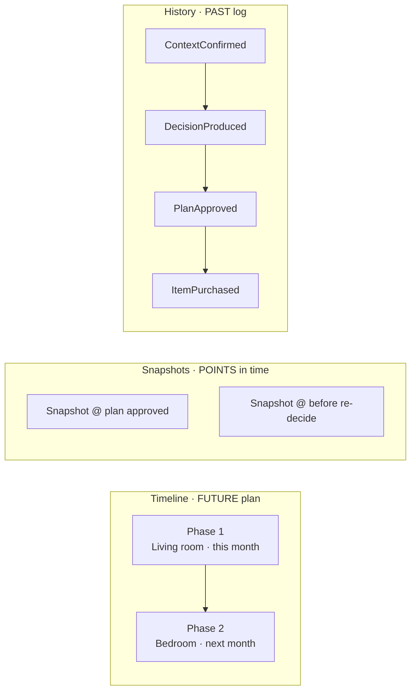
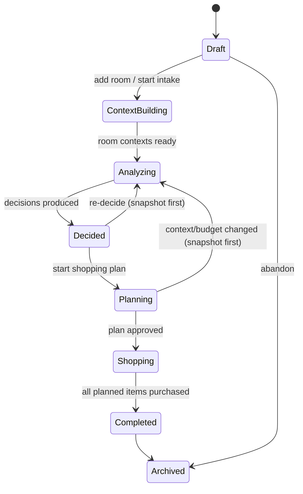

# Furnishing Project Model — the complete journey

- **Status:** Approved design (target model)
- **Date:** 2026-07-29
- **Scope:** The `Project` as the spine of the whole journey, from intake to purchases. Multi-room. No code.
- **Related:** `docs/domain_model.md`, `docs/decision_context.md`, `docs/knowledge_base.md`

> Extends the domain model: **one project now spans many rooms**, and the domain grows from *decision-making* into *decision execution & tracking* (Shopping Plan → Purchases). Everything from Shopping Plan onward is **new journey surface**, correctly out of the current MVP — it is additive, not a rewrite.

---

## 0) The journey in one line



**Three temporal concepts kept strictly distinct:**
- **Timeline** = the **future plan** — phases with target dates.
- **History** = the **past** — an append-only audit log of events.
- **Snapshots** = **points in time** — immutable full captures for compare / restore / versioning.

---

## 1) Aggregate boundary map

Five aggregates referenced by identity — not one giant object.



| Aggregate | Why its own boundary |
|---|---|
| **Project** | Consistency of multi-room budget allocation, timeline, and state |
| **Decision** | Immutable computed result per room/context-version; heavy; read-mostly |
| **ShoppingPlan** | Independent lifecycle (draft→active→completed); edited frequently |
| **Purchase** | Each real acquisition is a fact with its own lifecycle; append-only |
| **Snapshot** | Immutable capture; never mutated after creation |

---

## 2) The Project aggregate (Project · Rooms · Timeline · Budget · State)



- **Project** *(Aggregate Root)* — the whole journey for one home/effort. *Invariant:* valid state transitions; Σ room allocations ≤ budget total (unless `flexible`).
- **Room** *(Entity in Project)* — a sub-space, each with its own Decision Context, budget slice, current decision, and lifecycle state. Plurality is the key extension.
- **Timeline** *(Entity in Project)* — the forward plan: ordered **Phases** with target `DateRange` and status.
- **ProjectBudget** *(Entity in Project)* — multi-level money: `total` → per-room `allocations` → (inside a Decision) category `BudgetAllocation`. Derives `committed`/`remaining`.
- **ProjectState** *(VO)* — the state machine governing allowed operations (§6).

---

## 3) Recommendations & Alternatives (the Decision aggregate, per room)



- **Decision** *(Aggregate Root)* — immutable "**Recommendations**" for a room's context version.
- **DecisionOption** *(VO)* — a recommended pick for a requirement.
- **Alternative** *(VO)* — a ranked swap candidate attached to each option (the "**Alternatives**" concept). Swappable in the Shopping Plan.
- **Bundle** *(VO)* — the three coordinated tiers.

> Re-deciding never mutates a Decision — it produces a **new** `DecisionId`; a Snapshot is taken first.

---

## 4) Shopping Plan & Purchases (decision → execution)



- **Shopping Plan** *(Aggregate Root)* — the actionable buy-list derived from selected options across all rooms; ordered, grouped by room/phase, per-item status.
- **ShoppingItem** *(Entity)* — one thing to buy (chosen product or `selectedAlternative`, qty, estimate, phase, status).
- **Purchase** *(Aggregate Root, ×N)* — the fact that an item was bought; the thing that **consumes budget** (`committed`).

---

## 5) Budget rollup, Snapshots & History





- **Snapshot** *(Aggregate Root, immutable)* — `{SnapshotId, takenAt, SnapshotReason, CapturedState}`; enables compare & restore.
- **ProjectHistory** *(read model)* — append-only `HistoryEntry` projected from Domain Events.

---

## 6) Project State — and the nested lifecycles



```mermaid
stateDiagram-v2
  state "Room" as R {
    [*] --> Pending --> Contextualized --> Decided --> Planned --> PartiallyPurchased --> Purchased
  }
  state "ShoppingItem" as I {
    [*] --> PlannedI --> InCart --> PurchasedI
    PlannedI --> Skipped
  }
  state "Purchase" as PU {
    [*] --> Ordered --> Delivered
    Ordered --> Cancelled
    Delivered --> Returned
  }
```

- Re-deciding from `Decided/Planning/Shopping` **must take a Snapshot first** (traceability). Nested `RoomState / ShoppingItemStatus / PurchaseStatus` roll up into project state.

---

## 7) Value Objects & Domain Events (summary)

**Value Objects** — *Shared kernel:* `Money`, `Currency`, `Dimensions`, `Quantity`, `Confidence`, `Percentage`, `ContextVersion`, `ProductRef`, `FurnitureRole`, `Category`, `Priority`, `DateRange`, tags. *Project:* `ProjectState`, `RoomState`, `RoomBudget`, `Space`, `RoomDecisionContext`, `RequirementSet`, `Requirement`, `ConstraintSet`, `StyleProfile`, `Gap`/`GapSet`, `Phase`, `PhaseStatus`, `Title`. *Decision:* `DecisionOption`, `Alternative`, `Bundle`, `BundleTier`, `DecisionScore`, `ScoreFactor`, `Rationale`, `TradeOff`, `DecisionWarning`, `BudgetAllocation`. *Plan/Purchase:* `ShoppingItemStatus`, `ShoppingPlanState`, `PurchaseStatus`, `PurchaseDate`. *Temporal:* `SnapshotReason`, `CapturedState`, `HistoryEntry`.

**Domain Events:**

| Area | Events |
|---|---|
| Project | `ProjectStarted`, `RoomAdded`, `RoomRemoved`, `BudgetAllocated`, `TimelinePlanned`, `PhaseScheduled`, `ProjectStateChanged`, `ProjectArchived` |
| Context | `ContextConfirmed`, `DecisionContextUpdated`, `DecisionContextReady`, `ClarificationAnswered` |
| Decision | `DecisionRequested`, `DecisionProduced`, `AlternativeSelected`, `BudgetConflictDetected` |
| Shopping | `ShoppingPlanCreated`, `ShoppingItemAdded/Removed`, `ItemAssignedToPhase`, `ShoppingPlanApproved` |
| Purchase | `PurchaseRecorded`, `PurchaseDelivered`, `PurchaseReturned`, `PurchaseCancelled` |
| Temporal | `SnapshotTaken`, `SnapshotRestored` |

---

## 8) Key invariants

1. Σ `RoomBudget` allocations ≤ `ProjectBudget.total` (unless `flexible`).
2. A `Decision` is immutable and pinned to one `ContextVersion` + `PolicyVersion`.
3. A `ShoppingItem` references a product in its room's current `Decision` (chosen option **or** one of its alternatives).
4. `committed` = Σ `Purchase.pricePaid`; `remaining` = `total − committed`.
5. Re-deciding or restoring **always** produces a `SnapshotTaken` first.
6. `ProjectState` transitions follow §6; illegal operations are rejected.
7. Purchases are append-only facts; corrections are new events (`Returned`/`Cancelled`), never deletions.

---

## 9) MVP scoping note

Today's `FurnishingProject` (single room) becomes a **Project with one Room**; `Recommendations` → `Decision`. **Shopping Plan / Purchases / Timeline / Snapshots are post-MVP journey surface** — modeled here so the code can grow into them without a rewrite.
