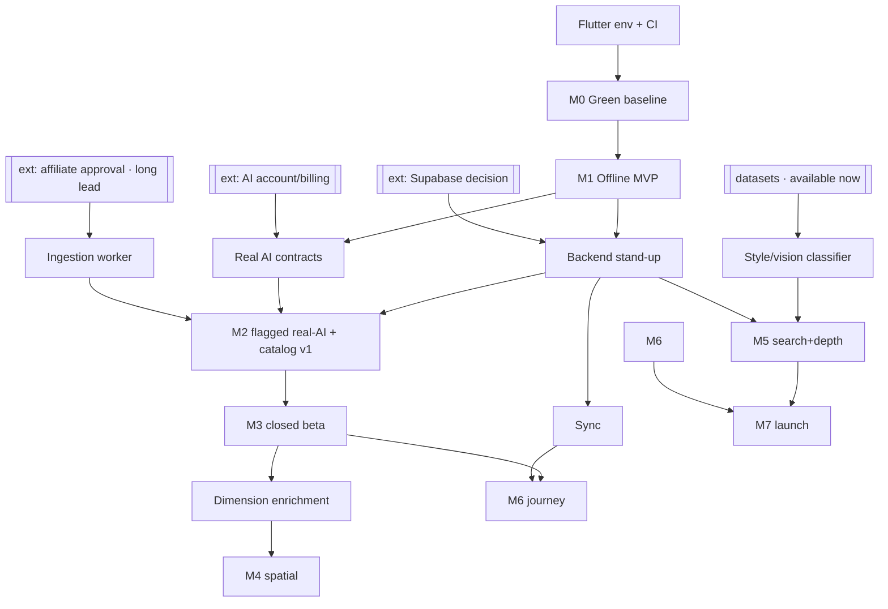

# Implementation roadmap — from unverified foundation to public beta

- **Status:** ⚠️ Superseded by `cto_roadmap.md` (evidence-first). Kept for reference — the build-sequenced view.
- **Date:** 2026-07-30
- **Scope:** The full execution plan: week‑by‑week (Months 1–3), month‑by‑month (Months 4–9), milestones, dependencies, risks, deliverables, and **stop conditions**. Turns the 20 approved design docs into a sequenced build.
- **Related:** every design doc, but especially `adr/0001-mvp-architecture-decisions.md`, `flutter_app.md`, `backend_architecture.md`, `catalog_data_sources.md`, `ai_layer.md`, `measurement_engine.md`, `furnishing_project_model.md`.

> **The honest starting line:** ~20 design docs are approved and a ~60‑file Flutter MVP foundation exists — **but it has never been compiled, analyzed, or tested** (no Flutter toolchain in the authoring environment). So the roadmap does **not** start at "build features." It starts at **verify**. Everything else is gated on a green baseline. The plan follows the project's two laws: **evolution over rewrite** and **no abstraction until it earns its place** — so every gate can pause without waste.

---

## 0) How to read this

- **Cadence:** 2‑week sprints; each milestone = 1–2 sprints. Week 1 = **Aug 2026** (relative labels used throughout; shift to your real start).
- **Team assumption (critical path):** 1–2 Flutter engineers, +1 backend engineer from Month 3, fractional AI/ML from Month 3, a product/domain owner throughout. **The timeline is the critical path for this lean team** — more engineers parallelize Phase 3/4 (catalog · spatial · journey are separable tracks), they don't shorten Phase 1.
- **"Done" means gated:** a milestone isn't done because code is written; it's done when its **exit gate** passes. Red gate ⇒ hold, fix, re‑gate.
- **Two clocks run in parallel:** the **build clock** (below) and the **external‑lead‑time clock** (affiliate approval, dev accounts, AI billing) — the second starts in Month 2 or the first stalls.

---

## 1) Phase map (phases → months → milestone)

| Phase | Months | Theme | Milestone (exit) |
|---|---|---|---|
| **1 — Verify & Harden** | 1–2 | make the foundation real: green build, persistence, full offline loop | **M0** Green Baseline · **M1** Demoable Offline MVP |
| **2 — Backend & Real AI** | 3–4 | additive backend + real AI behind the same contracts + first real catalog | **M2** Flagged real‑AI + backend · **M3** Internal closed beta on real data |
| **3 — Spatial & Catalog depth** | 5–6 | dimensions → measurement; more feeds; search | **M4** Spatially‑aware decisions · **M5** Catalog depth + search |
| **4 — Journey & Launch** | 7–9 | multi‑room project lifecycle; hardening; launch | **M6** Feature‑complete beta · **M7** Launch‑ready |

```mermaid
gantt
  title Furniture Decision System — 9-month critical path
  dateFormat YYYY-MM-DD
  axisFormat %b
  section Phase 1 · Verify & Harden
  M0 Green baseline (build+analyze+test+run) :crit, m0, 2026-08-03, 2w
  Local persistence (InMemory→Local)         :2026-08-17, 1w
  Full linear flow on device                 :2026-08-24, 1w
  Richer mock catalog + domain polish        :2026-08-31, 1w
  A11y + RTL + ARB localization              :2026-09-07, 1w
  Coverage + stabilize                       :2026-09-14, 1w
  M1 Dogfood + demo build                    :crit, m1, 2026-09-21, 1w
  section Phase 2 · Backend & Real AI
  Backend stand-up (Supabase + RLS)          :2026-09-28, 1w
  Sync + Remote user repo                    :2026-10-05, 1w
  First real AI contracts (Extract+Normalize):2026-10-12, 1w
  M2 Ingestion worker + Curated Release v1   :crit, m2, 2026-10-19, 1w
  Full AI contract set + cost controls       :2026-10-26, 2w
  M3 Harden + internal closed beta           :crit, m3, 2026-11-09, 2w
  section Phase 3 · Spatial & Catalog
  M4 Room Intelligence + Measurement Engine  :crit, m4, 2026-11-23, 4w
  M5 Search + style classifier + bundles     :crit, m5, 2026-12-21, 4w
  section Phase 4 · Journey & Launch
  M6a Journey: multi-room, shopping, purchases:2027-01-18, 4w
  M6b Hardening + monitoring (feature-complete):crit, m6, 2027-02-15, 4w
  M7 Security + a11y + launch-ready          :crit, m7, 2027-03-15, 4w
```

---

## 2) Milestones & exit gates

| # | Milestone | Exit gate (must ALL pass) |
|---|---|---|
| **M0** | **Green Baseline** | `flutter analyze` = *No issues found!* · `flutter test` = all pass · app **runs** the full mock flow on a device · CI runs the three on every push |
| **M1** | **Demoable Offline MVP** | a **non‑team person** completes a full furnishing decision **offline**, restarts, sees it **saved** · core screens have widget/golden tests · a11y AA + RTL pass · signed internal build |
| **M2** | **Flagged real‑AI + backend** | toggle real AI **on** → real Arabic input extracts correctly; **off** → identical mock behavior; **decisions deterministic either way** · one affiliate feed → **Curated Release v1** readable by the engine · app still fully offline |
| **M3** | **Internal closed beta** | 10–20 internal users run **real** projects 1–2 weeks · decision‑quality rating ≥ target · **AI cost/decision ≤ budget** · sync stable, no data loss |
| **M4** | **Spatially‑aware decisions** | "fits the room / clears the door‑swing," **explained** · validated against a set of real layouts · **false‑fit rate ≤ threshold** |
| **M5** | **Catalog depth + search** | ≥ N feeds ingested · GTIN→GS1/Icecat enrichment live · semantic "like‑this‑but‑cheaper" search meets relevance target |
| **M6** | **Feature‑complete beta** | multi‑room project · shopping plan · purchases · snapshots/compare · shell nav · monitoring dashboards green |
| **M7** | **Launch‑ready** | security review passed (RLS, server‑only keys, image PII strip, rate limit, right‑to‑erasure) · a11y audit · perf + cost SLOs · store submission ready · runbook |

---

## 3) Week‑by‑week — Months 1–3 (the part that needs precision)

### Month 1 — Verify & harden the core
| Wk | Focus | Deliverables | Depends on |
|---|---|---|---|
| **1** | **Env + CI** | Flutter toolchain locally + CI (GitHub Actions: `pub get` → `analyze` → `test` on push); run against the existing ~60 files; **error inventory** | a machine/CI with Flutter (the current blocker) |
| **2** | **Green baseline → G0** | fix **all** analyze errors → clean; fix/compile tests → all pass; run app, walk mock flow, fix crashes; **Gate G0** | Wk1 |
| **3** | **Local persistence** | choose + wire `LocalStore` (recommend Isar or drift) behind repo; `InMemory→Local`; projects/decisions survive restart; persistence tests | G0 |
| **4** | **Full linear flow on device** | complete stub screens in the core loop (input→analyzing→clarifications→summary→recommendations→product+explanation); explanation sheet; empty/error/offline states; core‑screen widget tests | G0 |

### Month 2 — Demoable Offline MVP
| Wk | Focus | Deliverables | Depends on |
|---|---|---|---|
| **5** | **Richer mock catalog + domain polish** | expand mock catalog (seed from open datasets per `catalog_data_sources.md`) across all essential categories; tune scoring/bundle output; explanation‑quality pass | Wk4 |
| **6** | **A11y + RTL + localization** | Semantics labels, dynamic type, contrast AA, 48dp; RTL audit; migrate `AppStrings`→**ARB** (ar primary, en optional); Arabic font; SAR/digit formatting | Wk4 |
| **7** | **Coverage + stabilize** | raise `domain_engine` coverage; controller + golden tests; dogfood bug‑fixes; perf pass (cold start, list scroll) | Wk5–6 |
| **8** | **Dogfood + demo → M1** | internal bug bash; signed demo build (TestFlight/internal track); **Milestone M1**, **Gate G1** | Wk7 · **[external: dev accounts applied in Wk5]** |

> **Run the external clock now (Month 2):** apply to **ArabClicks/Admitad** (approval can take 2–6 weeks), open **AI provider** billing, decide/provision **Supabase**, register **Apple/Google** developer accounts. These gate Month 3 — don't start them in Month 3.

### Month 3 — Phase 2 foundation (backend + first real AI)
| Wk | Focus | Deliverables | Depends on |
|---|---|---|---|
| **9** | **Backend stand‑up** | Supabase project; user‑data schema (projects/rooms/decisions/…) + **RLS**; anonymous auth; storage bucket w/ EXIF strip; migrations + seed (no client change yet) | M1 · Supabase decision · **backend eng onboarded** |
| **10** | **Sync + remote user repo** | `RemoteProjectRepository` behind the interface; pull‑since‑cursor + push‑mutations; LWW + tombstones; offline queue; flag local↔remote — **app still offline‑capable** | Wk9 |
| **11** | **First real AI contracts** | server‑side Edge Functions for **Extraction + Normalization** behind the **existing** contracts; structured‑output validation; retry→repair→**fallback‑to‑mock**; per‑contract mock↔real flag; cost logging | AI account · ACL unchanged |
| **12** | **Ingestion worker skeleton → M2** | worker: one feed (noon/ArabClicks) → normalize (Google‑feed shape) → dedup → **Curated Release v1**; `RemoteCatalogRepository` reads a pinned release; dimension gaps flagged; **Milestone M2**, **Gate G2** | affiliate approval **or** feed sample |

---

## 4) Month‑by‑month — Months 4–9

| Month | Phase | Work | Milestone / gate |
|---|---|---|---|
| **4** | 2 (finish) | remaining AI contracts (Style · MissingData · Question · Conflict → then Voice · Image); AI **cost controls + cache**; pin prompt/model version into each Decision; harden Curated‑Release pipeline; enrichment ladder **rung 1** (feed dims) solid, **rung 2** (GS1/Icecat) stubbed | **M3** Internal closed beta · **G3** (quality + AI‑cost gate) |
| **5** | 3a | room geometry capture UI (doors/windows/obstacles); **Room Intelligence** descriptive model; **Measurement Engine** (spacing/clearance/collision); catalog dimensions feed the spatial gate; **gap ⇒ degrade, never guess** | **M4** Spatially‑aware · **G4** (false‑fit rate) |
| **6** | 3b | more feeds through the same worker; enrichment **rung 2 live** (GTIN→GS1/Icecat); **style/vision classifier** trained on ABO/3D‑FUTURE; **pgvector** semantic search + Arabic FTS; bundle/package depth + **priority (buy‑first)** engine | **M5** Catalog depth + search · **G5** (relevance) |
| **7** | 4a | full **furnishing‑project journey**: multi‑room, budget rollup, **ShoppingPlan** (phased), purchases, alternatives, future‑purchases; **snapshots + history + compare**; wrap flow in **shell nav** (bottom‑nav branches) | **M6a** Journey (single‑user) |
| **8** | 4b | replacement mode (if in scope); cross‑device sync‑conflict UX; **monitoring** dashboards (latency, AI cost, decision counts, cache‑hit, queue‑depth); Sentry; perf/scale pass | **M6b** Feature‑complete beta · **G6** |
| **9** | 4 (launch) | **security review** (RLS · server‑only keys · image PII · rate‑limit · right‑to‑erasure); a11y audit; localization QA; store submission; cost/monitoring **SLOs**; launch **runbook** | **M7** Launch‑ready · **G7** |

---

## 5) Dependencies



**Hard blockers (what stops what):**

| This… | …blocks | Mitigation |
|---|---|---|
| Flutter env/CI absent (**today's blocker**) | *all* feature work | M0 is literally standing this up first |
| M0 green baseline | any feature | reconcile‑with‑docs if structural, not just fixes |
| Affiliate approval (**external, 2–6 wks**) | real catalog | apply Month 2; build worker against a **feed sample**; apply to Admitad/ArabyAds in parallel; mock stays as fallback |
| Dimension coverage in feeds | trustworthy spatial (M4) | enrichment ladder; **spatial‑advisory mode** if coverage low |
| Backend stood up | sync, remote repos, journey | provider decision in Month 2 |
| AI account/billing | real AI contracts | open in Month 2 (fast) |
| Datasets | style classifier / semantic search | **already available** — no external wait |

---

## 6) Risk register

| # | Risk | L | I | Mitigation | Surfaces in |
|---|---|---|---|---|---|
| R1 | Unverified code has **structural** issues, not just fixable errors | M | H | G0 in Wk1–2; if structural, pause & reconcile with design docs before features | M0 |
| R2 | **Affiliate approval** delayed/denied | M | H | apply early; build against feed **sample**; parallel networks; mock fallback | M2 |
| R3 | **Dimensions sparse** in feeds → spatial can't be trusted | **H** | H | enrichment ladder + GS1/Icecat; **gap ⇒ degrade/flag**; spatial‑advisory mode | M4 |
| R4 | **AI cost/decision** too high | M | M | mock‑first; skip‑AI‑when‑manual; cache; concise prompts; **G3 cost gate** | M3 |
| R5 | AI **extraction quality** poor on Saudi dialect/Arabic | M | H | keep behind flag; deterministic fallback; eval set; prompt eng; mock always works | M2–M3 |
| R6 | **Scope creep** → drifts into store/chatbot | M | H | per‑phase non‑goals (§8); the "AI understands / domain decides" invariant; ADR discipline | all |
| R7 | **Resourcing** shortfall | M | H | critical‑path sequencing; gates let you pause without waste | all |
| R8 | Offline↔online **sync conflict / data loss** | L‑M | H | single‑writer LWW + tombstones; snapshots; backups | M2, M6 |
| R9 | Catalog **price/availability staleness** → wrong rec | M | M | event‑refresh; pin per release; "as‑of" labeling | M2+ |
| R10 | **Determinism regression** (AI leaks into a decision) | L | H | ACL gate; property tests that real vs mock give identical *decisions*; G2 | M2+ |

---

## 7) Deliverables by milestone

- **M0:** CI pipeline · clean `analyze` · green `test` · running app · error‑fix changelog.
- **M1:** signed demo build · `LocalStore` persistence · ARB localization (ar/en) · a11y report · expanded mock catalog · widget/golden suite.
- **M2:** Supabase project + migrations · `RemoteProjectRepository` + `RemoteCatalogRepository` · 2 real AI Edge Functions **behind flags** · ingestion worker + **Curated Release v1** · feature‑flag config · cost log.
- **M3:** full 8‑contract AI set · cost dashboard · internal beta build · **closed‑beta report** (quality + cost + sync).
- **M4:** room geometry capture · **Measurement Engine** · spatial‑decision **validation report**.
- **M5:** multi‑feed ingestion · GS1/Icecat enrichment · style classifier + semantic search · **relevance report**.
- **M6:** journey features (shopping plan / purchases / snapshots / compare) · shell nav · monitoring dashboards.
- **M7:** **security‑review report** · a11y audit · SLO dashboards · store submission package · launch **runbook**.

---

## 8) Stop conditions (go / no‑go — distinct from risks)

**Do NOT proceed unless:**
1. **No feature work before G0.** Foundation must build, analyze clean, test green, and *run*.
2. **No Phase 2 before M1.** The offline loop must convince a real user *on mock data*. Phase 2 only adds real data behind the **same** loop — a weak loop scales weak.
3. **No wider beta before G3.** Decision‑quality **and** AI‑cost gates must pass with internal users first.
4. **No hard spatial gating until M4's false‑fit threshold is met.** Below it, spatial stays **advisory/flagged** — never a confident wrong "it fits."
5. **Real AI ships as default only when it's ≥ mock quality** on the eval set. Otherwise it stays behind the flag; mock is the default. Deterministic decisions are non‑negotiable.

**Pause (hold‑at‑gate):** any red gate ⇒ stop, fix, re‑gate. Phases are evolution, not rewrite — pausing wastes nothing.

**Pivot / re‑examine thesis:** if after **M1** test users don't trust the deterministic engine's recommendations *even with good data*, **stop before spending on backend/AI** and revisit the product thesis. The engine is the product; if it isn't trusted, no amount of infrastructure fixes that.

**Kill‑switch inputs:** affiliate + enrichment both fail to yield a purchasable, measurable catalog after honest effort ⇒ the "buy‑this, it‑fits" promise can't be met; de‑scope to an advisory‑only product or halt.

---

## 9) Non‑goals per phase (anti‑scope‑creep)

| Phase | Explicitly OUT |
|---|---|
| 1 | backend, real AI, real catalog, payments, multi‑room, shell nav |
| 2 | spatial math, semantic search, multi‑feed, purchases, checkout |
| 3 | payments/checkout, multi‑room journey, replacement inventory |
| 4 | in‑app payments/marketplace, becoming a store or chatbot — **ever** |

---

## 10) Invariants
1. **Verify before build** — no feature work on unverified code (G0 first).
2. **Every milestone is gated** — written ≠ done; the gate decides.
3. **Additive, always** — each phase swaps a data source or adds a screen behind an existing interface; **no rewrite**.
4. **Offline never regresses** — every phase keeps the app fully functional with zero network.
5. **AI never enters a decision** — real or mock, decisions stay deterministic and reproducible (pinned versions).
6. **Two clocks** — start external lead‑time items a month early or the build stalls.
