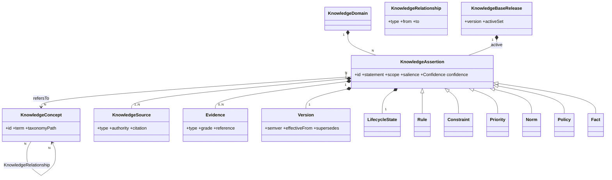
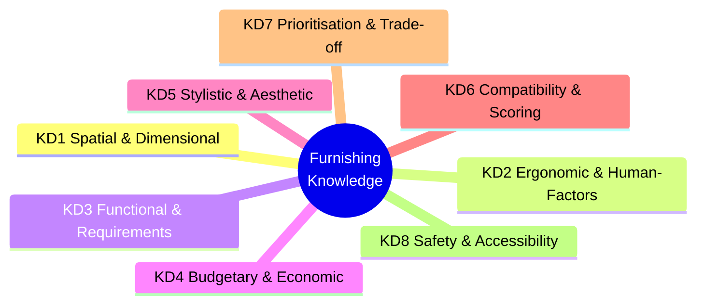
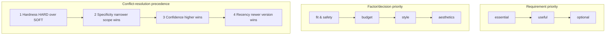
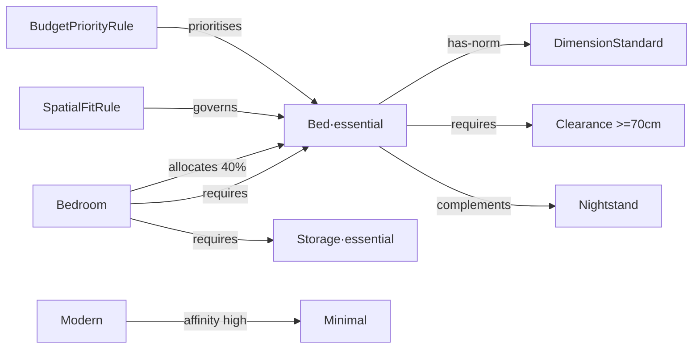
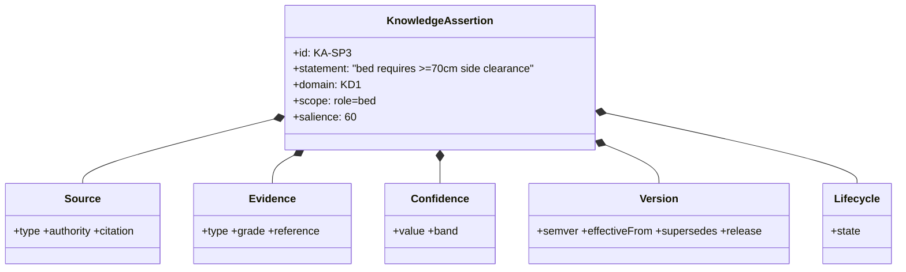
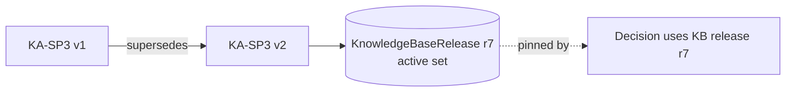

# Knowledge Base — the furnishing ontology

- **Status:** Approved design (target model)
- **Date:** 2026-07-29
- **Scope:** Product-agnostic, curated, declarative knowledge. **No products, no AI.** No code.
- **Related:** `docs/domain_model.md`, `docs/decision_context.md`, `docs/catalog_strategy.md` (products live there, not here)

> The Knowledge Base answers *"what does good furnishing reasoning know?"* — spatial fit, ergonomics, what a room needs, budget splits, style cohesion, prioritisation. It reasons over **roles and concepts**; the engine binds concept→product at decision time. Knowledge is **authored and versioned by people/standards, not learned.**

---

## 1) Upper ontology (the schema of knowledge itself)



**Two ontological layers:** **Concepts** (the vocabulary — nouns) and **Assertions** (statements about concepts — the actual knowledge). Every assertion is subclassed (Rule / Constraint / Priority / Norm / Policy / Fact) and carries five meta-facets (Source, Evidence, Confidence, Version, Lifecycle).

---

## 2) Knowledge Domains



| ID | Domain | Knows about |
|---|---|---|
| **KD1** | Spatial & Dimensional | fit, footprint, circulation/clearance, proportion |
| **KD2** | Ergonomic & Human-Factors | standard sizes, reach, viewing/comfort distances |
| **KD3** | Functional & Requirements | which roles a room needs; essentials vs optionals; dependencies |
| **KD4** | Budgetary & Economic | allocation per room, tiers, margins, funding order |
| **KD5** | Stylistic & Aesthetic | style/color/material taxonomy & affinity |
| **KD6** | Compatibility & Scoring | decision factors, weights, context adaptation |
| **KD7** | Prioritisation & Trade-off | ordering, conflict resolution, precedence |
| **KD8** | Safety & Accessibility | walkway minimums, tip-over, egress |

---

## 3) Knowledge Objects (Concepts)

| Object class | Examples |
|---|---|
| **Taxonomy concepts** | `RoomType`, `FurnitureRole{bed,sofa,storage,table,lamp,rug}`, `StyleTag{modern,minimal,classic}`, `ColorFamily{warm,cool,neutral}`, `Material{wood,fabric,metal}`, `BudgetTier{budget,balanced,premium}`, `DecisionFactor{roomFit,budgetFit,styleMatch,quality,preference}` |
| **Norm objects** | `DimensionStandard(role→W×D×H range)`, `ClearanceNorm(role→min circulation)`, `ProportionGuideline`, `ViewingDistanceNorm` |
| **Policy objects** | `BudgetDistributionPolicy(roomType→role→%)`, `ScoringWeightPolicy(factor→weight)`, `TierPolicy`, `MarginPolicy` |
| **Meta objects** | `KnowledgeAssertion`, `KnowledgeSource`, `Evidence`, `Version`, `LifecycleState`, `KnowledgeBaseRelease` |

> Concepts are **product-free**: `Bed` is a *role*, not an item.

---

## 4) Knowledge Rules

**Anatomy:** `WHEN <condition over concepts/context> THEN <conclusion> [salience, scope]`.

| Rule type (domain) | Example assertion |
|---|---|
| RequirementRule (KD3) | `KA-REQ1: roomType=bedroom ⇒ essential{bed, storage}, useful{lighting}` |
| SpatialFitRule (KD1) | `KA-SP1: role.footprint > roomArea·0.6 ⇒ oversized (exclude)` |
| ClearanceRule (KD1/KD8) | `KA-SP3: bed ⇒ require ≥70cm on at least one long side` |
| WeightAdaptationRule (KD6) | `KA-SC2: roomArea<12m² ⇒ boost roomFit weight` |
| BudgetPriorityRule (KD4) | `KA-BUD4: fund essentials before any optional` |
| StyleAffinityRule (KD5) | `KA-ST1: style=modern ⇒ affinity(minimal)=high, affinity(classic)=low` |
| ConflictRule (KD7) | `KA-CF1: budget < Σ essential floors ⇒ BudgetConflict → re-prioritise` |

Rules are **declarative and inspectable** — each traces to its source and evidence, so a decision can *cite the rule that produced it*.

---

## 5) Knowledge Constraints

| Kind | Hardness | Example |
|---|---|---|
| RangeConstraint | HARD | dimensions ∈ [1,30] m; height ∈ [2,6] m |
| SumConstraint | HARD | Σ scoringWeights = 1 · Σ budgetDistribution = 1 |
| FundingOrderConstraint | HARD | essentials funded before optionals |
| FitConstraint | HARD | a role must physically fit the space |
| PriceCeilingConstraint | HARD | role price ≤ categoryCeiling × factor |
| StyleHarmonyConstraint | SOFT | prefer style/color affinity (tradeable) |
| TierConstraint | SOFT/ADVISORY | premium not shown above budget except with warning |

**HARD** = never violable (⇒ exclusion/conflict). **SOFT** = preference as score penalty. **ADVISORY** = warning only.

---

## 6) Knowledge Priorities



Priorities are themselves **assertions** (`KA-PRIO-*`) — versioned and sourced, so the *ordering itself* is governable and explainable.

---

## 7) Knowledge Relationships

| Relationship | Meaning | Example |
|---|---|---|
| `is-a` | taxonomy | Bed is-a SleepingFurniture |
| `requires` | dependency | Bed requires SideClearance |
| `complements` | goes-with | Bed complements Nightstand |
| `conflicts-with` | exclusion | two large Sofas conflict in small room |
| `has-norm` | standard | Bed has-norm DimensionStandard |
| `governed-by` | rule scope | Bed placement governed-by SpatialFitRule |
| `allocates` | budget | Bedroom allocates 40% → Bed |
| `affinity` | aesthetic | Modern affinity Minimal |
| `derived-from` | provenance | effectiveWeights derived-from Policy+Context |
| `supersedes` | version | KA-SP1·v2 supersedes v1 |
| `supported-by` | evidence | KA-SP3 supported-by ClearanceStandard |

**Knowledge-graph example (bedroom):**



---

## 8) The Assertion atom — Sources · Confidence · Evidence · Versioning · Lifecycle



### 8a) Knowledge Sources
| Source type | Authority | Example |
|---|---|---|
| `DesignStandard` | high | published ergonomic/clearance norms |
| `ExpertHeuristic` | medium-high | interior-designer rules of thumb |
| `MarketConvention` | medium | regional room sizes / SAR budget norms |
| `InternalPolicy` | authoritative (business) | scoring weights, tier definitions |
| `ValidatedFeedback` | grows over time | corrections confirmed by review |

### 8b) Knowledge Confidence
`confidence = f(sourceAuthority, evidenceGrade, corroboration, recency) ∈ [0,1]`, in bands: **High ≥0.8** (may *govern* — hard rules), **Medium 0.5–0.8** (advisory-capable), **Low <0.5** (experimental / review-only). Higher confidence wins rule conflicts. *Distinct from Decision-Context confidence* (that is about input completeness; this is confidence in the *knowledge itself*).

### 8c) Knowledge Evidence
Justification backing an assertion — enables *"why this rule."* Grades: **A** citation/standard · **B** expert attestation / documented case · **C** rationale/heuristic only. A decision may surface the evidence chain behind each applied rule.

### 8d) Knowledge Versioning

Each assertion is **SemVer-versioned**; a **KnowledgeBaseRelease** bundles the active set; a **Decision pins the release** it used (reproducibility). New versions **supersede** (old retained, never mutated).

### 8e) Knowledge Lifecycle
```mermaid
stateDiagram-v2
  [*] --> Draft
  Draft --> Proposed --> Reviewed
  Reviewed --> Active : approved
  Reviewed --> Draft : changes requested
  Active --> Experimental : shadow test
  Experimental --> Active : validated
  Active --> Deprecated : superseded/stale
  Deprecated --> Retired
  Active --> Superseded : new version
  Retired --> [*]
```
Only **Active** assertions govern real decisions; **Experimental** run in shadow; **Deprecated/Retired** are retained for audit but excluded from releases.

---

## 9) How the engine consumes the KB (no products, no AI)

For a Decision Context, the engine: resolves the **effective policy** (weights/distribution) → gathers **Active rules** in scope → enforces **HARD constraints** (filter) → applies **SOFT constraints** as score penalties → resolves conflicts by **precedence** → attaches the **evidence/version** of every rule fired. Concept→product binding happens *after* this, outside the KB.

---

## 10) Invariants

1. Assertions are **immutable per version**; change = new version + `supersedes`.
2. Only **Active** assertions in a pinned **Release** affect decisions.
3. Every governing assertion has **≥1 Source** and a **Confidence band**; HARD rules require **High** confidence + **Grade-A/B** evidence.
4. Priorities and weights are **themselves versioned assertions** (nothing hard-coded conceptually).
5. The KB is **product-free and AI-free** by construction.

---

## 11) Relationship to current code

Today these live as **hard-coded constants** in `lib/domain_engine/` (scoring weights in `recommendation/scoring.dart`, budget distributions in `budget/budget_allocator.dart`, role mapping in `recommendation/category_mapper.dart`, filtering rules in `recommendation/recommendation_engine.dart`, thresholds in `business_rules/`). Adopting this ontology means **externalising those constants into versioned, sourced assertions** — a behavior-preserving refactor, not a rewrite.
