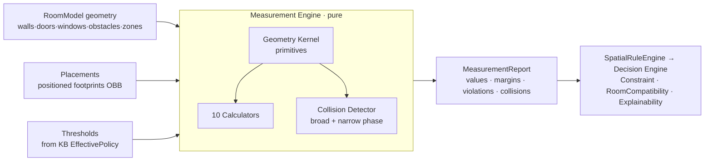
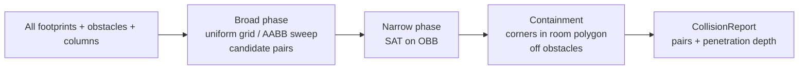

# Measurement Engine — the spatial calculator

- **Status:** Approved design (target model)
- **Date:** 2026-07-29
- **Scope:** Pure geometric calculator for clearances/distances/collisions. Formulas + architecture. No code.
- **Related:** `docs/room_intelligence.md`, `docs/knowledge_base.md`, `docs/decision_engine.md`, `docs/explainability.md`

> A **pure, deterministic geometry engine**. It sits *below* the `SpatialRuleEngine` from Room Intelligence: **the Knowledge Base owns the thresholds, the Measurement Engine owns the math.** Computes in **cm**; no AI, no business decisions.

---

## 1) Architecture



- **Inputs:** `RoomModel` (geometry), `Placement[]` (a piece = an oriented footprint at a position), `Thresholds` (from KB).
- **Output:** `MeasurementReport { measurements[], collisions[], violations[] }` — each measurement is `{ name, value_cm, threshold_cm?, satisfied, margin_cm }`.
- **Properties:** pure · deterministic · unit = cm · O(n) via broad-phase · thresholds injected (never hard-coded).

---

## 2) Geometry Kernel (the primitives every formula uses)

Notation: point `P=(Px,Py)`; segment `AB`; footprint = **OBB** (center `C`, half-extents `(hw,hd)`, rotation `θ`); `·` = dot; `|v|` = norm.

```
dist(P,Q)              = √((Qx−Px)² + (Qy−Py)²)

distPointSeg(P,A,B):
    t   = clamp( ((P−A)·(B−A)) / |B−A|² , 0, 1)
    proj= A + t·(B−A)
    ⟹ dist(P, proj)

distSegSeg(A,B,C,D)    = 0                       if AB ∩ CD ≠ ∅
                       = min( distPointSeg(A,C,D), distPointSeg(B,C,D),
                              distPointSeg(C,A,B), distPointSeg(D,A,B) )   otherwise

gapAABB(a,b):                                     // axis-aligned rectangles
    dx = max(bx1−ax2, ax1−bx2, 0)
    dy = max(by1−ay2, ay1−by2, 0)
    gap = √(dx² + dy²)                            // 0 ⟺ overlap
    overlapArea = max(0,min(ax2,bx2)−max(ax1,bx1)) · max(0,min(ay2,by2)−max(ay1,by1))

overlapOBB(A,B)  via SAT: for each axis L ∈ {edge-normals(A) ∪ edge-normals(B)}:
    if project(A,L) ∩ project(B,L) = ∅  ⟹  SEPARATED (no collision)
    if no separating axis exists          ⟹  COLLISION

pointInPolygon(P, poly): ray-cast; odd crossings ⟹ inside
cornersOBB(C,hw,hd,θ)  = C + R(θ)·(±hw,±hd)       // R = rotation matrix
```

---

## 3) The 10 calculations (formulas)

Let `piece` = OBB; `wall/door/window` from `RoomModel`; thresholds `T_*` from KB.

| # | Calculation | Formula | Satisfied when |
|---|---|---|---|
| 1 | **Walking distance** | path length `L = Σ|Pᵢ₊₁−Pᵢ|`; corridor width at path = `min over samples s: (gap between the two nearest bounding edges ⟂ to path)` | `corridorWidth ≥ T_walkway (60–90)` |
| 2 | **Furniture spacing** | `spacing(A,B) = gapAABB/OBB(A,B)` (0 if overlap) | `spacing ≥ T_spacing` (0 if intentionally adjacent) |
| 3 | **Wall clearance** | `wallClr(piece,wall) = minₖ distPointSeg(cornerₖ, wall.A, wall.B)` | against-wall: `≤ ε`; free: `≥ T_standoff` |
| 4 | **TV distance** | `diag = √(w²+h²)` (or in×2.54); `d = dist(seatFront, screenCenter)` | `1.5·diag ≤ d ≤ 2.5·diag` |
| 5 | **Bed clearance** | per non-wall side: `sideClr = gap(bedEdge, nearest{wall,obstacle,piece})` | `long side ≥ 70`, `other ≥ 60`, `foot ≥ 90 if walkway` |
| 6 | **Dining spacing** | pull-out `= gap(tableEdge, nearest{wall,obstacle}) − chairDepth`; seats/side `= ⌊edgeLen / 60⌋` | `pullOut ≥ 75` (`+30` if pass-behind) |
| 7 | **Door opening** | swing = quarter-disk radius `R = leafWidth` at hinge `H`, sweep `[θ₀,θ₀+90°]`; front clear depth `Dfront` | no footprint within swing sector **and** `Dfront ≥ T_door (≈90)` |
| 8 | **Window clearance** | `blockLen = overlap(pieceWallProjection, windowSpan)`; `frac = blockLen/winWidth` | if `piece.h > sillHeight`: `frac ≤ T_block (≈0)`; low pieces exempt |
| 9 | **Corner spacing** | corner sectional fits iff `arm₁ ≤ usableLen(W1)` and `arm₂ ≤ usableLen(W2)`; diagonal access `= gap at inner corner` | arms fit **and** `diagClr ≥ T_corner` |
| 10 | **Collision detection** | broad: `gapAABB=0`; narrow: `overlapOBB(A,B)=COLLISION`; containment: `∀ corners pointInPolygon(room)` **and** `¬overlap(piece, obstacle/column)` | no overlap **and** fully inside room, off obstacles |

**Door swing sector test (7), detailed:** a footprint collides with the swing iff
`minDist(H, footprint) ≤ R  ∧  angularRange(footprint about H) ∩ [θ₀, θ₀+90°] ≠ ∅`.
Sliding door → clearance is the **slide corridor** along the wall of length = leafWidth, kept clear.

---

## 4) Collision detection pipeline



- **Broad phase** avoids O(n²): bucket footprints into a grid; only test pairs sharing a cell. `overlap ⟺ gapAABB=0`.
- **Narrow phase** SAT for rotated pieces; returns **penetration depth** (min overlap across axes) for severity.
- **Containment** ensures every piece is inside the room polygon and off columns/obstacles.

---

## 5) Contracts

```
Placement      { productRef, footprint: OBB(center, hw, hd, θ), zoneRef?, faces? }
MeasurementResult { name, value_cm, threshold_cm?, satisfied: bool, margin_cm }
CollisionPair  { a, b, penetration_cm }
MeasurementReport { measurements: MeasurementResult[], collisions: CollisionPair[],
                    violations: MeasurementResult[]  // subset where !satisfied
                  }
```

---

## 6) Integration
- **Room Intelligence** supplies the geometry (walls/zones/paths/obstacles) and calls the Measurement Engine inside its `SpatialRuleEngine`.
- **Decision Engine:** Constraint Engine turns **collisions / blocked door / blocked path / blocked egress** into HARD exclusions; Scoring's **RoomCompatibility** becomes `f(satisfied clearances, margins)` instead of the crude footprint ratio; **Explainability** cites concrete numbers (*"70 cm bed side clearance, 75 cm walkway, door swing clear"*).
- **KB** provides every `T_*` threshold (versioned), so the same geometry can be re-judged under different policies.

---

## 7) Invariants
1. **Geometry only** — no thresholds hard-coded; all `T_*` injected from the KB.
2. **Deterministic & pure** — same inputs → same report; cm throughout; explicit tolerance `ε`.
3. **Conservative** — ambiguous/low-confidence geometry ⟹ report `unknown` (not a false pass).
4. Collisions and blocked egress/door/path are **HARD**; spacing/distance shortfalls are graded margins.

---

## 8) Mapping to current code
Today `lib/domain_engine/recommendation/scoring.dart` `_roomCompatibility` is a **1-calculation degenerate Measurement Engine**: only footprint-vs-room-area ratio + a fits/rotated check (≈ collision #10 without obstacles, and no clearances). Adoption is additive: introduce the **Geometry Kernel** + calculators; `_roomCompatibility` calls the engine when geometry exists, else keeps the ratio.
