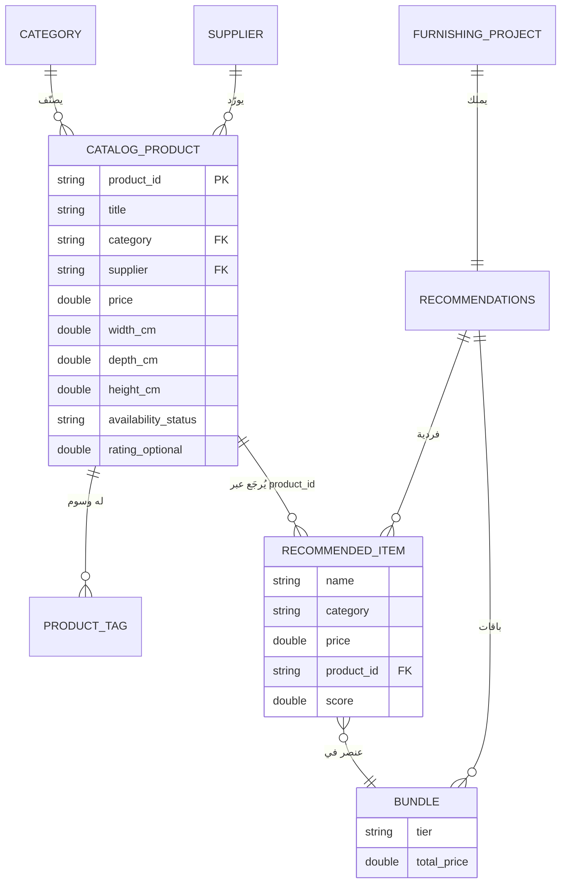

# product_catalog_erd.md — نموذج بيانات الكتالوج (ERD)

> النموذج المنطقي لبيانات المنتجات ومصدرها. متوافق مع الكود:
> `lib/shared/models/catalog_product.dart` والمصدر الحالي
> `assets/catalog/catalog.json` (القرار G2: ملف JSON ثابت في الـ MVP).

## 1) الكيان المركزي: CatalogProduct

| الحقل | النوع | إلزامي | ملاحظات |
|---|---|---|---|
| `product_id` | String | ✅ | مفتاح فريد؛ يُرجَع في `RecommendedItem.product_id` |
| `title` | String | ✅ | اسم العرض (عربي) |
| `category` | enum `RecommendationCategory` | ✅ | bed \| sofa \| rug \| table \| lamp \| storage \| other |
| `subcategory` | String | — | تصنيف فرعي حر |
| `style_tags` | String[] | — | modern/minimal/classic… (لـ style_match) |
| `color_tags` | String[] | — | ألوان (لـ style/user-pref) |
| `material_tags` | String[] | — | خامات |
| `width_cm` / `depth_cm` / `height_cm` | double | — | أبعاد القطعة (لـ room compatibility) |
| `price` | double | ✅ | بعملة `currency` |
| `currency` | String | — | افتراضي SAR |
| `brand` / `supplier` | String | — | العلامة/المورد |
| `availability_status` | String | — | in_stock \| out_of_stock (تصفية التوفر) |
| `rating_optional` | double? | — | إشارة الجودة (10%) |
| `room_suitability_tags` | String[] | — | bedroom/living_room/guest_room |
| `image_url` / `product_url` | String | — | روابط (فارغة في الـ MVP) |

## 2) المخطط (ERD)



> ملاحظة: `PRODUCT_TAG`, `CATEGORY`, `SUPPLIER` **مطبّعة منطقيًا** هنا، لكنها في الـ MVP
> **مضمّنة (denormalized)** داخل مستند المنتج في JSON.

## 3) العلاقة بمحرّك التوصيات
`RecommendationEngine` (في `domain_engine`) يقرأ `CatalogProduct[]` عبر
`CatalogRepository`، يُصفّي/يُقيّم، ثم يشير إلى المنتج بـ `product_id` داخل
`RecommendedItem`. **لا يعرف المحرّك مصدر الكتالوج** (JSON الآن، Firestore لاحقًا).

## 4) استراتيجية التطور (catalog_strategy.md)
- **المرحلة ١ (الآن):** JSON ثابت (`assets/catalog/catalog.json`، ~20 منتجًا).
- **المرحلة ٢:** كتالوج داخلي منسّق يدويًا (50–200 منتج).
- **المرحلة ٣/٤:** ربط مزوّد + **Firestore**.

### تخطيط Firestore المستقبلي (تصميم فقط — غير مُنفَّذ الآن)
```
products/{product_id}         → مستند CatalogProduct (منظّم)
suppliers/{supplier_id}       → بيانات المورد
categories/{category}         → بيانات وصفية للفئة
```
- فهارس على: `category`, `availability_status`, `price`.
- **فصل الإدخال (ingestion) عن طبقة التوصيات**، وتخزين **نسخة منظّمة (normalized)**
  من بيانات المنتجات (operational notes في catalog_strategy.md).
- سياسة تحديث الأسعار/التوفر.

## 5) معايير الجودة
أبعاد صحيحة · سعر واضح · تصنيف متسق · صور جيدة · توافر محدَّث عند الإمكان.

## 6) قابلية الاختبار
- الكتالوج الثابت يجعل اختبارات المحرّك **حتمية** (انظر
  `test/domain_engine/recommendation_engine_test.dart`).
- تحقّق `fromJson/toJson` في `CatalogProduct` عبر اختبارات النماذج.
