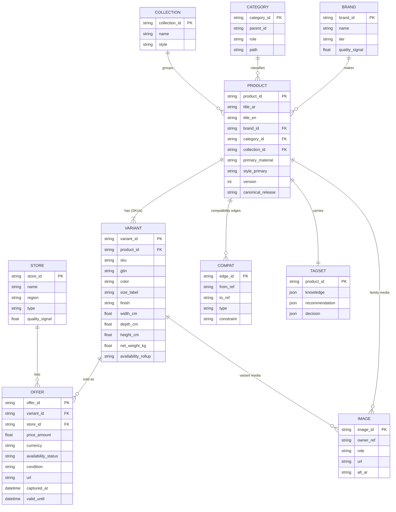

# Product Information Model (PIM) — complete schema & ERD

- **Status:** Approved design (target model)
- **Date:** 2026-07-29
- **Scope:** The full per-product information model — every facet + everything the Decision Engine needs. No code.
- **Related:** `docs/catalog_strategy.md`, `docs/product_catalog_erd.md`, `docs/decision_engine.md`, `docs/knowledge_base.md`, `docs/explainability.md`

---

## 0) Framing — three levels + three tag families

**Levels** (a product is not flat):
- **Product (family)** — the canonical item; shared attributes (brand, style, classification, base spec).
- **Variant (SKU)** — a specific color/size/finish; may **override dimensions/weight/finish/color/images**.
- **Offer** — a variant sold by a store at a price/time (commercial; time-series). *(Offers attach to variants, not families.)*

**Three distinct tag families** (no overlap):
- **Knowledge Tags** — *ontological* bindings to the Knowledge Base vocabulary (role, style, material, room-suitability). What KB rules match on.
- **Recommendation Tags** — *ranking signals* (popularity, quality tier, value band, rating). Bias scoring's quality/preference factors.
- **Decision Tags** — *operational computed flags* (space_saver, budget_friendly, requires_companion). Used for fast filtering + explanation labels.

---

## 1) ERD



---

## 2) Where each attribute lives

| Facet | Family | Variant | Offer |
|---|---|---|---|
| Identity | canonical id, title, brand | SKU, GTIN, axis values | offer id |
| Classification | category, collection, role | — | — |
| Dimensions | base/default | **override per size** | — |
| Weight | base | **override per size** | (packaged/shipping) |
| Material | primary + composition | override if differs | — |
| Finish / Color | default | **per variant** | — |
| Style | family style tags | — | — |
| Brand | ref | — | — |
| Store | — | — | ref |
| Offers | — | list under variant | the offer |
| Images | family gallery | **variant photos** | — |
| Availability | rollup (any variant) | rollup (any offer) | per-offer status |
| Compatibility | product-level edges | size-specific edges | — |
| Tags (3 families) | mostly family | color/size-derived | — |

---

## 3) Complete Schema (JSON-shaped, no code)

```jsonc
// ===== PRODUCT (family) =====
{
  // «Identity»
  "product_id": "string",            // canonical, stable
  "title": {"ar": "string", "en": "string"},
  "identifiers": {"gtin": "string?", "mpn": "string?"},
  "version": 0,                      // product version (spec changes)
  "canonical_release": "string",     // CuratedCatalogRelease pin

  // «Classification»
  "category_id": "string",           // taxonomy leaf
  "category_path": ["seating","sofas","loveseat"],
  "role": "bed|sofa|storage|table|lamp|rug|other",   // KB FurnitureRole
  "subcategory": "string?",
  "collection_id": "string?",

  // «Brand»
  "brand_id": "string",              // -> Brand entity

  // «Style»
  "style": {
    "tags": ["modern","minimal"],    // controlled vocab
    "design_era": "string?",
    "notes_ar": "string?"
  },

  // «Material» (family default)
  "material": {
    "primary": "wood",
    "composition": {"wood": 0.7, "fabric": 0.3},
    "tags": ["wood","fabric"]
  },

  // «Dimensions» (family default; variants may override)
  "dimensions": {"width_cm": 0, "depth_cm": 0, "height_cm": 0,
                 "footprint_cm2": 0, "seat_height_cm": null, "diameter_cm": null},

  // «Weight» (family default)
  "weight": {"net_kg": 0, "gross_kg": null},

  // «Finish» (family default)
  "finish": {"type": "matte|gloss|textured", "surface_treatment": "string?",
             "color": {"family": "neutral|warm|cool", "name": "string", "hex": "#RRGGBB?"}},

  // «Images» (family gallery)
  "images": [
    {"image_id":"string","role":"primary|gallery|dimension_diagram|room_scene",
     "url":"string","alt_ar":"string","w":0,"h":0}
  ],

  // «Compatibility» (intrinsic product-to-product)
  "compatibility": [
    {"type":"fits_with|requires|complements|part_of_set|variant_of|successor_of",
     "target_ref":"product_id|variant_id","constraint":"string?"}
  ],

  // «Variants»
  "variant_axes": ["color","size","finish"],
  "variants": [ /* Variant objects, see below */ ],

  // «Availability» (family rollup)
  "availability": {"status":"in_stock|limited|out_of_stock|discontinued",
                   "regions":["SA"],"lead_time_days":null},

  // ===== TAG FAMILIES =====
  // «Knowledge Tags» — ontology bindings (what KB rules match)
  "knowledge_tags": {
    "role": "bed",
    "style_tags": ["modern"],
    "color_family": "neutral",
    "material_tags": ["wood"],
    "room_suitability": ["bedroom","guest_room"],
    "ergonomic_class": "string?",
    "safety_flags": ["tip_over_risk?"],
    "_meta": {"taxonomy_version":"3.0.0","confidence":0.0,"source":"normalized|curated"}
  },
  // «Recommendation Tags» — ranking signals (bias scoring)
  "recommendation_tags": {
    "rating": {"value": 0.0, "count": 0},
    "popularity_band": "low|medium|high",
    "quality_tier": "budget|standard|premium",
    "value_band": "poor|fair|good|great",
    "return_rate_band": "low|medium|high",
    "trending": false,
    "editor_pick": false
  },
  // «Decision Tags» — operational computed flags (filter + explain)
  "decision_tags": {
    "space_saver": false,
    "fits_small_room": false,
    "budget_friendly": false,
    "premium": false,
    "essential_capable": true,
    "requires_companion": false,      // e.g., frame needs mattress
    "assembly_required": false,
    "oversized_risk": false,
    "_derived": [{"flag":"fits_small_room","rule_ref":"KA-SP2","since_release":"r7"}]
  },

  // provenance / lineage (sources abstracted away)
  "spec_attributes": {"/* free canonical spec */": "string"}
}
```

```jsonc
// ===== VARIANT (SKU) =====
{
  // «Identity»
  "variant_id": "string", "product_id": "string",
  "sku": "string", "gtin": "string?",
  // axis values
  "axis": {"color":"string?","size_label":"string?","finish":"string?"},
  // «Dimensions/Weight/Finish» overrides (else inherit family)
  "dimensions": {"width_cm":0,"depth_cm":0,"height_cm":0},
  "weight": {"net_kg":0,"gross_kg":null},
  "finish": {"color":{"family":"","name":"","hex":null}},
  // «Images» specific to this variant
  "images": [{"image_id":"string","role":"primary","url":"string","alt_ar":"string"}],
  // «Offers»
  "offers": [ /* Offer objects */ ],
  // «Availability» rollup from offers
  "availability": {"status":"in_stock|limited|out_of_stock","stock_level":null}
}
```

```jsonc
// ===== OFFER =====
{
  "offer_id":"string","variant_id":"string","store_id":"string",
  "price":{"amount":0,"currency":"SAR"},
  "original_price":{"amount":0,"currency":"SAR"},   // for discount display
  "availability_status":"in_stock|out_of_stock|preorder",
  "condition":"new|used|open_box",
  "url":"string",
  "shipping":{"cost":0,"eta_days":0,"region":"SA"},
  "captured_at":"iso8601","valid_until":"iso8601?"
}
```

```jsonc
// ===== SUPPORTING ENTITIES =====
"Brand": {"brand_id":"string","name":"string","tier":"budget|mid|premium","quality_signal":0.0,"country":"string?"}
"Store": {"store_id":"string","name":"string","region":"string","type":"marketplace|brand_store|local","quality_signal":0.0,"return_policy":"string?","url":"string"}
"Category": {"category_id":"string","parent_id":"string?","name":{"ar":"","en":""},"role":"","synonyms":[],"version":"3.0.0"}
"Collection": {"collection_id":"string","name":"string","style":"string"}
```

---

## 4) The three Tag Families — distinct roles

| Family | Nature | Examples | Engine use |
|---|---|---|---|
| **Knowledge Tags** | ontological (controlled vocab, KB-bound) | role, style, color_family, material, room_suitability | ConstraintEngine (role/suitability filter) · ScoringEngine (StyleMatch) · KB rule matching |
| **Recommendation Tags** | ranking signals | rating, popularity_band, quality_tier, value_band | ScoringEngine (QualitySignal 10% · PreferenceMatch) · tie-breaking |
| **Decision Tags** | operational computed flags | fits_small_room, budget_friendly, requires_companion, oversized_risk | ConstraintEngine (fast eligibility) · BundleComposer (cohesion) · Explainability (labels + `_derived` rule refs) |

Each tag carries **provenance + confidence + taxonomy/release version** so explanations can cite them (`explainability.md`).

---

## 5) Everything the Decision Engine needs — field mapping

| Engine (decision_engine.md) | Reads from PIM |
|---|---|
| **CandidateProvider** | Product family + selected representative **Offer** → `Candidate` |
| **Constraint Engine** | `dimensions`, `availability`, `role`/`category`, offer `price`, `decision_tags`, variant `axis` (match user constraints), `material`/`finish` |
| **Scoring Engine** | `dimensions` (RoomFit) · offer `price` (BudgetFit) · `knowledge_tags.style/color/material` (StyleMatch) · `recommendation_tags.rating/quality_tier` (Quality) · color/style vs user prefs (Preference) |
| **Budget Engine** | offer `price`, `category`/`role` |
| **Priority Engine** | `role`, `decision_tags.essential_capable` |
| **Alternative Engine** | `role` + dimension band + price band + `compatibility`/substitution |
| **Explainability** | `decision_tags._derived` (rule refs), `knowledge_tags._meta` (provenance/confidence) |

> The engine's `Candidate` VO = Product intrinsic (dims, tags, rating) **+** the resolved Offer's `price`/`availability`.

---

## 6) Versioning & provenance

- **Product version** (spec change) · **Variant version** · **Offer time-series** (price/availability history) · **Taxonomy version** · **Tag confidence + release**.
- A **CuratedCatalogRelease** bundles a consistent snapshot; a **Decision pins the release** (reproducibility — mirrors KB releases).

---

## 7) Invariants

1. **Offers attach to variants**, not families; **price never lives on Product/Variant** (only on Offer).
2. Every Product → exactly one **Category (leaf)** and one **Brand**.
3. Every Product has **≥1 Variant** (a single-variant product still has one SKU).
4. Variant attributes **inherit** family defaults unless overridden (dims/weight/finish/color/images).
5. Availability **rolls up** offer → variant → product.
6. All three tag families use **controlled vocabularies** with provenance + version.
7. Decision Tags are **derived** and carry a `rule_ref` for explainability.

---

## 8) Mapping to current code (evolution)

Today `lib/shared/models/catalog_product.dart` is a **flat** record conflating family + variant + one offer + a few tags. Evolution (additive, staged):
1. Split into **Product (family) · Variant · Offer** with inheritance.
2. Promote `Brand`/`Store` to entities (currently plain strings).
3. Introduce the **three tag families** (today: only `style_tags`/`color_tags`/`material_tags` ≈ knowledge tags; `rating` ≈ a recommendation tag; **no decision tags yet**).
4. Keep `assets/catalog/catalog.json` as `CuratedCatalogRelease v0`; enrich toward this schema over releases.

No rewrite — the current `CatalogProduct` is the **single-variant, single-offer projection** of this model.
