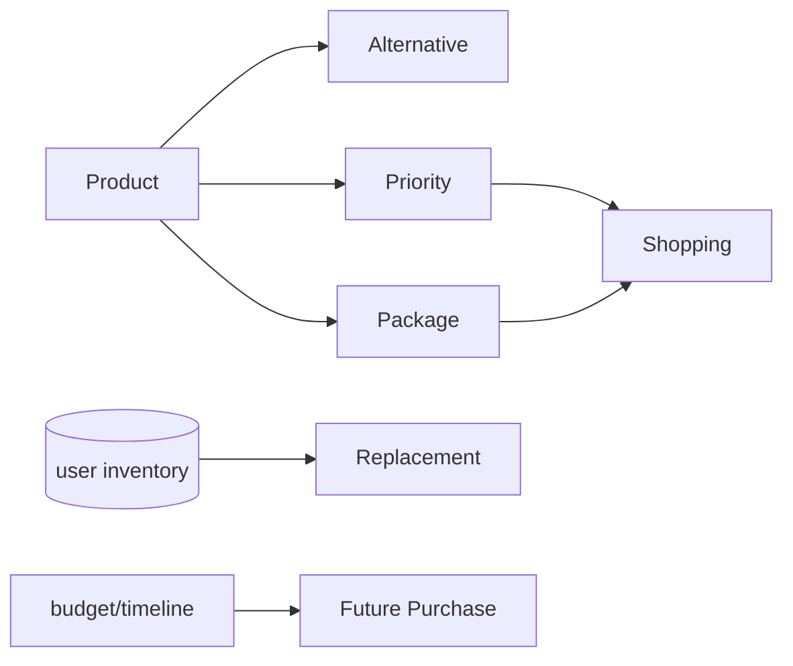
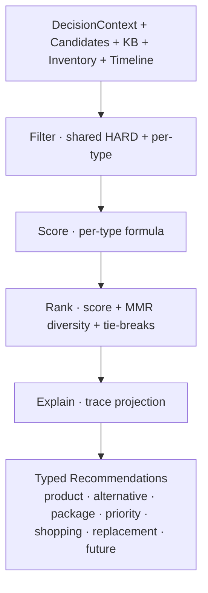

# Recommendation Engine — types, scoring, ranking, filtering

- **Status:** Approved design (target model)
- **Date:** 2026-07-29
- **Scope:** The 7 recommendation types + shared filter/score/rank/explain pipeline. No code.
- **Related:** `docs/decision_engine.md` (the engines that produce these), `docs/explainability.md`, `docs/furnishing_project_model.md`, `docs/knowledge_base.md`, `docs/product_information_model.md`

> Complements `decision_engine.md`: that doc decomposes the *engines*; this doc defines the *recommendation types* and how each is scored, ranked, filtered, and explained. All 7 types flow through one pipeline (**filter → score → rank → explain**), specialized per type.

---

## 1) The 7 recommendation types

| Type | Answers | Produced by | Scored by |
|---|---|---|---|
| **Product** | "which item for this need?" | Recommendation Engine (select) | 5-factor `DecisionScore` |
| **Alternative** | "what else instead of X?" | Alternative Engine | relative Δ vs chosen |
| **Package** | "a coordinated set?" | Bundle Engine | aggregate + cohesion + completeness |
| **Priority** | "what to buy first?" | Priority Engine | urgency + dependency + leverage |
| **Shopping** | "my ordered/phased buy-list?" | ShoppingPlan assembly | priority × phase × availability |
| **Replacement** | "upgrade what I own?" | Replacement mode (vs inventory) | improvement delta |
| **Future Purchase** | "what to add later?" | Deferral (budget/timeline) | desirability × deferability |



---

## 2) Unified model

```
Recommendation {
  id, type: product|alternative|package|priority|shopping|replacement|future,
  subject,                       // productRef | bundle | requirement | plan-item
  score: TypedScore,             // per-type (see §3)
  confidence,                    // from context + knowledge + margin
  rank,                          // within its type
  explanation: Explanation,      // faithful, traceable (explainability.md)
  payload                        // type-specific fields
}
```

---

## 3) Scoring design

**Base product score** (shared): `S = 100·(0.35·room + 0.30·budget + 0.20·style + 0.10·quality + 0.05·pref)` — weights context-adapted by KB `PolicyResolver`.

| Type | Score formula |
|---|---|
| **Product** | `S` (base) |
| **Alternative** | rank by `S(a)`; annotate `ΔS = S(a)−S(chosen)`, `Δprice`; keep only *meaningfully different* (`similarity(a,chosen) < σ`) |
| **Package** | `Pkg = w₁·avg(memberS) + w₂·cohesion + w₃·budgetFit(total) + w₄·completeness − overBudgetPenalty` · `cohesion` = style/color tag consistency · `completeness` = essentialsCovered/essentialsRequired |
| **Priority** | `Pr(req) = base(essential 3 / useful 2 / optional 1) + depBoost(has dependents) + budgetLeverage(unlocks others) + readiness` |
| **Shopping** | not scored — *ordered*: by `Pr` desc, grouped by **phase**, gated by **availability**; "buy-now vs defer" = `f(budgetFit, availability, deal)` |
| **Replacement** | `Repl(new|cur) = (S(new)−S(cur))·wImprove + conditionFactor(cur) − switchingCost(price(new))`; recommend iff `Repl > T_replace ∧ S(new)−S(cur) > minΔ` |
| **Future** | `Fut(item) = desirability(S(item)) · deferability(item)`; `deferability↑` if optional, over current budget, or assigned to a later phase |

---

## 4) Ranking design

1. **Primary:** the type's score, descending.
2. **Diversity (MMR):** `score' = λ·relevance − (1−λ)·maxSimilarity(alreadySelected)` — prevents 3 near-identical beds.
3. **Tie-breaks (in order):** availability → quality signal → lower price → data freshness.
4. **Cross-type presentation order:** Priority/essentials first → Packages → per-item Products → Alternatives (on demand) → Future.
5. **Caps:** top-N per requirement (essentials 2, optional 1); ≤ N alternatives per option.

---

## 5) Filtering design

**Shared HARD** (Constraint + Measurement Engines): role match · fits space / no collision / clears door-swing/path/egress · available · price ≤ category ceiling×factor · honors explicit user constraints. **SOFT** → score penalties (style/color mismatch).

**Per-type eligibility:**

| Type | Additional filter |
|---|---|
| Product | matches a requested role |
| Alternative | same role as chosen · different product · within spec/price band · `similarity < σ` |
| Package | covers **all essentials** · total ≤ budget (premium may exceed → flagged) |
| Priority | only **unsatisfied** requirements |
| Shopping | only **selected/approved** options · exclude already-purchased |
| Replacement | an existing item to replace · `improvementΔ > threshold` · not recently bought |
| Future | optional **or** didn't fit current budget/phase · excluded from current plan |

---

## 6) Explain every recommendation (per `explainability.md`)

Each type gets a faithful, traceable, **contrastive** explanation projected from the Decision Trace:

| Type | Explanation shape |
|---|---|
| Product | "fits the room · within the bed budget · matches modern" + factor breakdown + rule refs |
| Alternative | **contrastive**: "vs chosen — cheaper by 230, fit −0.1" |
| Package | "essentials covered · total 1,610 ≤ 1,800 · cohesive (wood/beige)" + top trade-off |
| Priority | "buy first — essential and the nightstand depends on it" |
| Shopping | "phase 1 now (in stock, within budget); phase 2 next month" |
| Replacement | "upgrade: +0.2 fit, +0.6 quality for +180; current is undersized/worn" |
| Future | "defer to phase 2 — optional and over current budget; revisit when budget allows" |

Every claim maps to a `TraceEvent`/`AppliedRule`; low confidence ⟹ caveat.

---

## 7) Architecture (one pipeline, typed outputs)



---

## 8) Invariants
1. **One pipeline, seven specializations** — filter/score/rank/explain shared; only the formulas + eligibility differ.
2. Every recommendation of every type carries an **Explanation** (no unexplained output).
3. Business decisions stay in the engines; **AI never scores or ranks**.
4. HARD filters (fit/collision/availability/constraint) apply to **all** types before scoring.
5. Ranking enforces **diversity**; essentials/priority always precede optionals/future.

---

## 9) Mapping to current code
Today the engine emits only **Product** (`individual_items`) and **Package** (`bundles`). The other five are **new**: Alternative (slice 5, designed), Priority (needs budget-aware funding), Shopping/Future (need `ShoppingPlan`/`Timeline` from `furnishing_project_model.md`), Replacement (needs a user **inventory**). All slot into the existing `filter → score → rank → explain` shape — additive, no rewrite.
