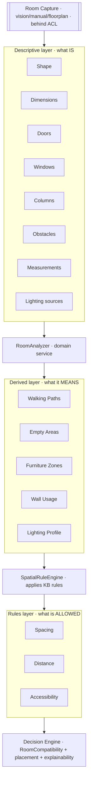

# Room Intelligence — the system understands the space

- **Status:** Approved design (target model)
- **Date:** 2026-07-29
- **Scope:** The spatial model that upgrades `Space { roomType, dimensions }` into a full room understanding. Product-agnostic; AI/vision behind an ACL. No code.
- **Related:** `docs/decision_context.md`, `docs/knowledge_base.md`, `docs/decision_engine.md`, `docs/vision_architecture.md`, `docs/domain_model.md`

> Room Intelligence is about the **space**, not the furniture. AI/vision only *captures* geometry (behind an ACL); the domain *reasons* over it deterministically. It feeds the Decision Engine's Room Compatibility + placement + explainability.

---

## 0) Three layers



- **Descriptive** = measured geometry + fixed features (provenance-tracked).
- **Derived** = zones/paths/wall-usage/lighting computed by a deterministic **RoomAnalyzer**.
- **Rules** = spacing/distance/accessibility, sourced from the **Knowledge Base** (KD1 spatial · KD2 ergonomic · KD8 safety), applied by a **SpatialRuleEngine** to validate placements.

---

## 1) Coordinate model
2-D floor plane, origin at a corner, `x` = width, `y` = length, **cm**. Walls are segments; wall-attached features (doors/windows) are positioned by `(wall_id, offset)`; free elements (columns/obstacles) by footprint `(x, y, w, d)`; zones/areas as polygons (or rects in MVP).

---

## 2) The RoomModel

```mermaid
classDiagram
  class RoomModel { +RoomId id +version +RoomType type +spatialConfidence +provenance }
  class Shape { +type +polygon +area +perimeter }
  class Dimensions { +width +length +height +floorArea +usableArea +volume }
  class Wall { +id +from +to +orientation +length }
  class Door { +id +wall +offset +width +swing +clearanceRadius }
  class Window { +id +wall +offset +width +sillHeight +faces }
  class Column { +id +at +w +d +height }
  class Obstacle { +id +type +footprint +height +movable }
  class Measurement { +field +value +method +confidence }
  class WalkingPath { +id +polyline +minWidth +priority +mustKeepClear }
  class EmptyArea { +id +polygon +area +adjacentWalls }
  class FurnitureZone { +id +role +region +wallAdjacency +capacity }
  class WallSegment { +wall +length +usableLength +openings +backingAvailable }
  class LightingProfile { +zones +primaryDaylight }
  class AccessibilityProfile { +profile +minCorridor +turningRadius +egressClear }

  RoomModel *-- Shape
  RoomModel *-- Dimensions
  RoomModel *-- "N" Wall
  RoomModel *-- "N" Door
  RoomModel *-- "N" Window
  RoomModel *-- "N" Column
  RoomModel *-- "N" Obstacle
  RoomModel *-- "N" Measurement
  RoomModel *-- "N" WalkingPath
  RoomModel *-- "N" EmptyArea
  RoomModel *-- "N" FurnitureZone
  RoomModel *-- "N" WallSegment
  RoomModel *-- LightingProfile
  RoomModel *-- AccessibilityProfile
```



---

## 3) The 15 elements

**Descriptive**
- **Room Shape** — `rectangular | l_shaped | irregular | open`; polygon + area + perimeter.
- **Dimensions** — width/length/height; derived floor area, **usable area** (after obstacles), volume.
- **Doors** — wall + offset + width + **swing** (in/out/left/right/sliding) + clearance arc → must not be blocked.
- **Windows** — wall + offset + width + sill/head height + facing → affect wall usage, lighting, placement.
- **Columns** — free-standing structural footprints that break zones + cut usable area.
- **Obstacles** — fixed non-movables (radiator, built-in, HVAC, outlet, soffit); columns are a subtype.
- **Measurements** — every value carries `method: tape|vision|floorplan|estimate` + **confidence** (provenance).
- **Lighting sources** — natural (per window: direction/intensity) + artificial fixtures.

**Derived (by RoomAnalyzer)**
- **Walking Paths** — circulation routes (door→door, entry→zones) with `min_width` that **must stay clear**.
- **Empty Areas** — free floor polygons after subtracting features/obstacles/paths → placement candidates.
- **Furniture Zones** — role-tagged regions (`sleeping | seating | storage | dining | circulation`) with capacity + wall adjacency; where pieces go.
- **Wall Usage** — per-wall `usable_length` (minus openings/columns) + `backing_available` → for against-wall pieces (bed, wardrobe, sofa).
- **Lighting Profile** — bright/medium/dim zones + primary daylight direction.

**Rules (from KB, applied by SpatialRuleEngine)**
- **Spacing Rules** — min gaps: walkway 60–90 cm, ≥70 cm bed side, ≥90 cm in front of wardrobe. *(KB KD1/KD2.)*
- **Distance Rules** — functional: TV 1.5–2.5× diagonal, nightstand within reach of bed, dining chair pull-out ~90 cm. *(KB KD2.)*
- **Accessibility** — corridor ≥ profile min, door-swing clear, **unobstructed egress**, turning radius (standard vs accessible profile). *(KB KD8.)*

---

## 4) Complete schema (JSON-shaped)

```jsonc
{
  "room_id":"string","version":0,"room_type":"bedroom|living_room|...",
  "shape":{"type":"rectangular|l_shaped|irregular|open","polygon":[{"x":0,"y":0}],"area_cm2":0,"perimeter_cm":0},
  "dimensions":{"width_cm":0,"length_cm":0,"height_cm":0,"floor_area_cm2":0,"usable_area_cm2":0,"volume_cm3":0},
  "walls":[{"wall_id":"W1","from":{"x":0,"y":0},"to":{"x":400,"y":0},"orientation":"S","length_cm":400}],
  "doors":[{"door_id":"D1","wall_id":"W1","offset_cm":40,"width_cm":90,"swing":"in_left","clearance_radius_cm":90}],
  "windows":[{"window_id":"N1","wall_id":"W2","offset_cm":120,"width_cm":150,"sill_height_cm":90,"faces":"E"}],
  "columns":[{"column_id":"C1","at":{"x":200,"y":300},"width_cm":30,"depth_cm":30,"height_cm":270}],
  "obstacles":[{"obstacle_id":"O1","type":"radiator","footprint":{"x":0,"y":250,"w":80,"d":15},"height_cm":60,"movable":false}],
  "lighting":{"natural":[{"window_ref":"N1","direction":"E","intensity_band":"high"}],"artificial":[{"fixture_id":"L1","type":"ceiling","at":{"x":200,"y":300},"coverage":"room"}]},
  "measurements":[{"field":"width_cm","value":400,"unit":"cm","method":"vision","confidence":0.6,"captured_at":"iso"}],
  "walking_paths":[{"path_id":"P1","from":"D1","to":"Z_sleeping","polyline":[{"x":85,"y":10}],"min_width_cm":75,"priority":"primary","must_keep_clear":true}],
  "empty_areas":[{"area_id":"E1","polygon":[{"x":0,"y":0}],"area_cm2":0,"adjacent_walls":["W3"],"near_window":true}],
  "furniture_zones":[{"zone_id":"Z_sleeping","role":"sleeping","region":{"x":220,"y":60,"w":170,"d":220},"wall_adjacency":["W3"],"capacity_hint":"1 double bed + nightstands"}],
  "wall_usage":[{"wall_id":"W3","length_cm":600,"usable_length_cm":520,"openings":["N1"],"orientation":"W","backing_available":true}],
  "lighting_profile":{"zones":[{"region":{"x":0,"y":0,"w":200,"d":200},"level":"bright"}],"primary_daylight":"E"},
  "accessibility":{"profile":"standard","min_corridor_cm":75,"turning_radius_cm":null,"egress_clear":true},
  "spatial_confidence":0.0,"provenance":"vision|manual|floorplan|mixed"
}
```

---

## 5) Domain services
- **RoomCaptureAssembler (ACL)** — raw capture (vision/manual/floorplan) → descriptive `RoomModel`; sets measurement provenance/confidence. *AI lives only here.*
- **RoomAnalyzer** — descriptive → derived (empty areas, paths, zones, wall usage, lighting profile) using KB spatial norms. Pure/deterministic.
- **SpatialRuleEngine / PlacementValidator** — given a `Placement { productRef, zone, position, footprint, orientation }`, checks spacing/distance/accessibility → `PlacementResult { valid, violations[], clearances }`.

---

## 6) How it feeds the Decision Engine
Enriches **RoomCompatibility** from today's crude footprint-ratio to real spatial reasoning:

| Engine input | Room Intelligence provides |
|---|---|
| Constraint (HARD) | piece must fit an **empty area / suitable zone**; must not block **door swing / walking path / egress** |
| Scoring · RoomCompatibility 35% | fits zone + leaves required **clearances** (spacing) + **wall backing** if needed + respects **distance** rules |
| BundleComposer | zone **capacity** (does the room hold bed + wardrobe + nightstands?) |
| Explainability | spatial reasons: *"placed against the 5.2 m wall, leaves a 75 cm walkway, clears the door swing"* |

---

## 7) Provenance, confidence, versioning
- Every measurement/feature carries **method + confidence**; `spatial_confidence` rolls up → low confidence downgrades spatial reasoning to advisory (ties to `decision_context.md` gaps/provenance).
- `RoomModel.version` bumps on edit; a Decision pins the room version it reasoned over.

---

## 8) MVP degradation + mapping to code
Graceful degradation — **no geometry ⇒ current behavior**:

| Known | RI behaves as |
|---|---|
| dimensions only (today's `Room`) | one empty rectangle, no features → **current footprint-ratio fit** |
| + doors/windows | wall-usage + basic path clearance |
| + full geometry | zone placement + spacing/distance/accessibility |

Today `lib/shared/models/room.dart` (`roomType + width/length/height`) is the **degenerate RoomModel** (rectangle, no features). Adoption is additive: `RoomModel` wraps `Room`; `scoring._roomCompatibility` grows into a `SpatialRuleEngine` call when geometry exists, else keeps the ratio.

---

## 9) Invariants
1. AI/vision only in the **ACL**; derived + rules layers are deterministic.
2. Walking paths & egress are **HARD** — never blocked by a placement.
3. Every geometric value has **provenance + confidence**.
4. Spacing/distance/accessibility rules come from the **KB** (versioned) — not hard-coded in Room Intelligence.
5. Missing geometry never breaks decisions — it **degrades**, and low `spatial_confidence` becomes an advisory caveat.
